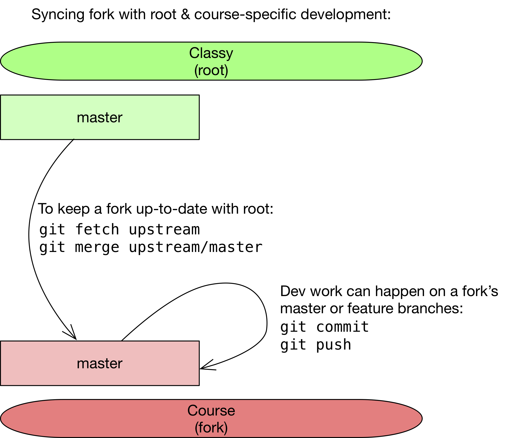
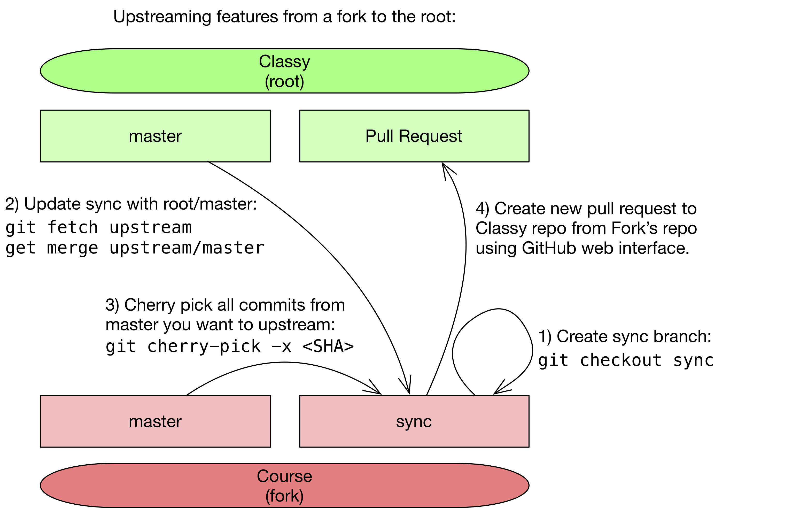

# Classy

[](https://circleci.com/gh/ubccpsc/classy)
[](https://coveralls.io/github/ubccpsc/classy?branch=master)


Classy is a classroom management system developed by the Department of Computer Science at UBC. Classy is tightly integrated with GitHub and has the ability to automatically provision student repositories, create teams, and mark assignments. Administrators can configure deliverables, enter grades, and view comprehensive dashboards of all student test executions. Students can use the system to create teams (if required) and view their grades and assignment feedback.

Primary contributors:

* [Reid Holmes](https://www.cs.ubc.ca/~rtholmes/)
* [Nick Bradley](https://nickbradley.github.io/)

Main course forks:

* [ubccpsc210/classy](https://github.com/ubccpsc210/classy)
* [ubccpsc221/classy](https://github.com/ubccpsc221/classy)
* [ubccpsc310/classy](https://github.com/ubccpsc310/classy)
* [cpsc340/classy](https://github.com/CPSC340/classy)
* [secapstone/classy](https://github.com/SECapstone/classy)
* [MDS TBD](NOTSETYET)

## Development Process

Classy has been developed as a minimal framework for helping courses stand up a system that can provide GitHub management, team formation, grade distribution, and AutoTest. Courses are free to use any subset of that functionality that they wish. It is important to note that _some_ development work will be required for any course wishing to use Classy; e.g., at the very least, the student view must be defined per-course and this must be done in code. Classy is _not_ intended to provide a comprehensive system that can be fully configured through its provided interfaces. That said, the extensions courses need to make should be small and contained, unless your own requirements are somewhat unusual.

All core Classy development will take place on [ubccpsc/classy](https://github.com/ubccpsc/classy). This repository will contain the base Classy image, but will not contain any course-specific code. Courses wishing to deploy Classy should fork this repo and make any custom changes to their own Classy fork. 

During the term, `ubccpsc/classy` will only receive critical bug fixes so courses should feel comfortable pulling these into their forks if the bug fixes are relevant to them. Major changes will only be made to `ubccpsc/classy` during exam breaks (e.g., December, April, and August). Reid Holmes will act as the `ubccpsc/classy` custodian for evaluating and merging these bug fixing PRs as well as the feature-based PRs below.

Forks are highly encouraged to issue PRs from their fork to `ubccpsc/classy` for any bug fixes; please make sure these fixes also pass the Classy test suite. The quality bar for these fixes will be high because we need to ensure they will not negatively impact other classes should they decide to pull from master.

For new features, forks are also encouraged to issue PRs _during_ the term for consideration during the merging period. Again, since this code will be going into master, please make sure that:

* The new feature should have been validated 'in production' in the fork's current course instance; we want to know for sure that code has worked for another class before adding it to `ubccpsc/classy`.
* It makes sense for the functionality to be in `ubccpsc/classy` rather than the course-specific fork (e.g., the feature should have broad appeal to many other course instances).
* The feature is well tested and the code of high quality. 
* Any additional tests do not overly burden the overall test suite execution duration, and should be resilient to future changes.
* The contribution must lint before it can be accepted (e.g., `cd classy/; yarn run lint`).

We will do our best to merge new features as long as they make sense for `ubccpsc/classy`, but if a feature is not merged it can exist as a long-lived feature in a course's fork. These features can also be merged between forks via PR as well if it makes sense to do so.


## Configuration

Full details about how classy should be configured can be found in [docs/config.md](docs/config.md).

## Dev overview

All Classy development should take place in a course-specific fork. Bug fixes to core `ubccpsc/classy` code can be issued via PR back to `ubccpsc/classy` as required, as can feature-addition PRs (as described above). Classy has been configured with CircleCI for validating patches and any PR that fails to pass CI will not be merged.

Forks are encouraged to work using PRs on their local repos as well as using these will make it easier to upstream fixes and new features back to `ubccpsc/classy`.

To do this you can:

```
# if you made some changes and forgot to branch:
git stash
git checkout -b <DESCRIPTIVE_BRANCH_NAME>
git stash pop
git commit -a
git push --set-upstream origin <DESCRIPTIVE_BRANCH_NAME>

# if you didn't forget to branch first:
git checkout -b <DESCRIPTIVE_BRANCH_NAME>
git commit -a
git push --set-upstream origin <DESCRIPTIVE_BRANCH_NAME>
```

<!--
You can open a PR on GitHub at any time for your branch, but it cannot be merged until the PR passes all CI checks.
-->

The following guidelines can be helpful for evaluating any PRs on a local fork (although obviously these are up to the fork maintainer and will only be enforced if PRs are made back to `ubccpsc/classy`):

1. The Pull Request must pass all existing tests. New contributions should not require existing tests to be changed as other courses might depend on the modified behaviour; if you feel such a change is needed, please mention the rationale in the Pull Request comments.

2. The test coverage of the system must be maintained; the expected coverage rate for any given file should be 90%+. We require tests be provided for any new contributions as without these it is extremely challenging to ensure that future development for other courses will not break your new contribution.

3. Finally, any contributions must lint before they can be accepted. This can be run using `yarn run lint` in `classy/`. The global rules in `/tslint.json` should not be changed.

To help with regular development, CircleCI testing [docs/cirleCI.md](can be setup) for a fork to ensure that coverage, test, and linting requirements are met each time code is pushed to your fork.

## Merging magic


## Main repos:

* `ubccpsc/classy/master` (hereby `root`) is the stable source for the repo
* `<user>/classy/master` (hereby `fork`) is where classes are going to want to work (there will be many of these `fork` repos)

## Goals:

* `fork/master` needs be able to make any changes it needs during the term without impacting `root/master`
* `fork/master` needs to be able to accept critical patches during the term from `root/master`
* `fork/master` needs be able to accept new feature changes at the end of the term, but only a ***subset*** of commits
* `fork/master` needs to be able to contribute changes to `root/master`

### Fork initialization

This only needs to happen once per fork, so if you already have a configured fork with a sync branch, you can ignore this step.

1. Fork `root` into a GitHub account you control (hereby called the `fork`).
2. Create a branch called `sync` on your `fork` (`git branch sync`) and create `fork/sync` on the server (`git push origin sync`).
3. Add the upstream branch `git remote add upstream https://github.com/ubccpsc/classy.git` ([LINK](https://help.github.com/articles/configuring-a-remote-for-a-fork/)).

## Development process

All `fork` changes should be made on `fork/master` or other branches (just ***not*** on `fork/sync`).

### Pulling changes from `root/master` into `fork/master` 

This can happen regularly, whenever there is a `root/master` change that fixes a bug or adds a feature that the fork might want.
 
On `fork`:
1. `git checkout master`
1. `git fetch upstream` (pulls down the changes from `root/master` to your local repo).
1. `git merge upstream/master` (merges the changes into your local repo).
1. `git push` (pushes the changes from your local repo to its remote GitHub repo).



### Pushing changes from `fork` to `root/master`

This is ***not*** likely to happen during the term, except for critical patches but it _is_ likely to happen at the end of the term when new features should be upstreamed to `root`.

On `fork`: 
1. Pull changes from `root/master` into `fork/sync` (described above but replace `master` with `sync` in the two relevant commands).
1. `git checkout sync` (probably already checked out).
1. `git cherry-pick -x <SHA>` for each `<SHA>` you want to upstream. BE CAREFUL: these commits should not include any course-specific code. Also, to clarify, these commits should be in the history of `fork/master`. Merge conflicts are likely at this step and need to be resolved before moving to the next step.
1. `git push origin sync` (sends cherry picked commits to server).
1. Open the `sync` branch in the GitHub web interface and make a pull request `fork/sync` to `root/master` (sends cherry picked commits to `root/master` that can then be evaluated in a PR before being merged into `root/master`).



### Customizing your instance of Classy

1. To add to the backend, you should modify `packages/portal/backend/src/custom/CustomCourseController.ts` and `packages/portal/backend/src/custom/CustomRoutes.ts`. These changes should ***NOT*** be pushed back into `classy/master` but should only stay in the fork.
2. To add to the frontend, you should add the `pacakges/portal/frontend/src/app/custom/CustomStudentView.ts`. These changes should ***NOT*** be pushed back into `classy/master` but should only stay in the fork.

### About dev packages

Wherever possible, please try to minimize external package dependencies. Classy has been configured to use [yarn workspaces](https://yarnpkg.com/lang/en/docs/workspaces/#toc-how-to-use-it).
You should add global dependencies to the root `package.json` and package-specific dependencies in the package-level `package.json`.

Specific dev instructions are included in [`packages/portal/backend/README.md`](packages/portal/backend/README.md), [`packages/portal/frontend/README.md`](packages/portal/frontend/README.md), and [`packages/autotest/README.md`](packages/autotest/README.md).

## License

[MIT](LICENSE)
