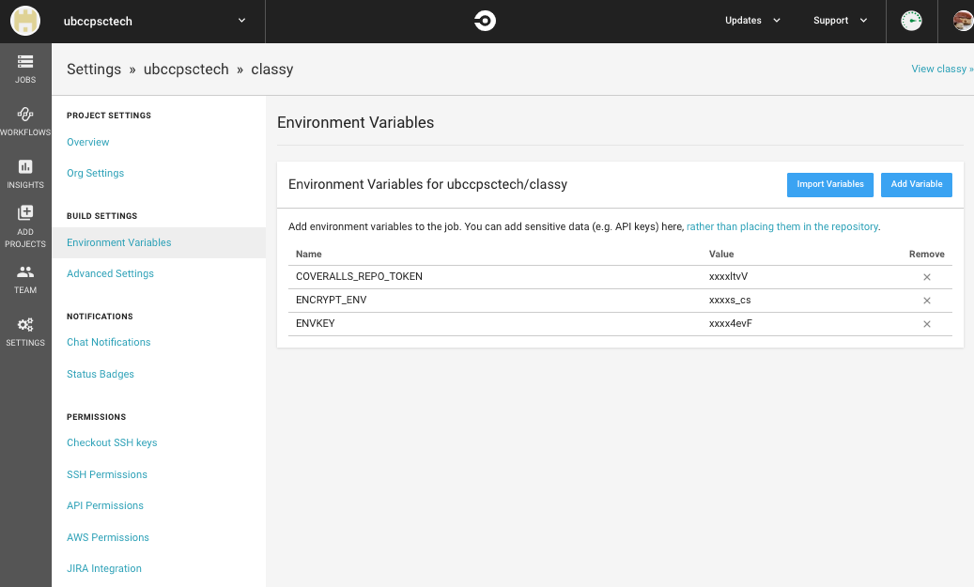

# CircleCI Continuous Integration Setup

A pull-request MUST pass all tests in the continuous integration (CI) test suite before it is merged into the `master` branch of the root `ubccpsc` project. This setup ensures that code may only be merged into the `master` branch:

1. Through a pull-request opened on Github.
2. Approved by at least one member of the project, AND ONLY (c.)
3. ONLY after all tests pass.

   Code will be tested on any branch pushed to the remote `origin` of your fork. A passing CircleCI check is necessary to merge code into your main `master` branch, which will be enforced by Github and code contributors.

## Services to Integrate

There are three services that must be integrated to successfully setup CI for Classy: 

- Github.com/Github Enterprise
- Circle CI
- Coveralls

Circle CI is a testing tool that integrates directly with Github and is free for use on public repositories. It automatically runs test suites against code that is pushed to any remote Git repository branch. Circle CI allows environment variables to be, securely, included in your test runs while integrating with other services, such as Coveralls.

A `yml` file is included in the `./circleci` directory of the `classy` repository. The `yml` file contains the steps that Circle CI uses to run tests and create a coverage report. Necessary encrypted files, which are also included in the `.circleci` directory, are decrypted during Circle CI runtime using an an `ENVKEY` that is mentioned in the "Setup Instructions" in this README.

Coveralls is a code coverage tool that visually charts the code coverage percentage of a Git repository.

## How Continuous Integration Works

1. A developer pushes code to a Github branch.
2. The CircleCI Classy test suite runs against the code pushed to the branch.
3. CircleCI produces a coverage report that is sent to Coveralls.
4. CircleCI notifies Github with test pass or fail status.
5. Github denies or allows code to be merged based on pass or fail status.

## Services Setup Instructions

### Circle CI Setup

Register for a CircleCI account on [CircleCi.com](https://circleci.com) and grant Circle CI access to the organization or user account where the `classy` fork is hosted. Click on "Add Projects" and select the `classy` repository from a list of repos under the organization or user account.

Click on the `classy` project. Under the `classy` project view, click on the cog-wheel on the right (not left panel). Underneath the "Build Settings", you must add the two environment variables below:

    COVERALLS_REPO_TOKEN: randomLongString
    ENVKEY: randomLongString

- `ENVKEY` is private and you must ask a project owner for it.
- `COVERALLS_REPO_TOKEN` is unique to each `classy` repository fork and found in the next step.
- `ENCRYPT_ENV` variable is the filename of the CircleCI `.enc` integration file that you would like to use during CircleCI tests see [CircleCI Github Integration](#circleci-github-integration).

#### CircleCI Github Integration

Running Classy’s continuous integration test suite requires a live Github integration. Github.com or Github Enterprise integrations are possible with Classy.

The Github organization, domain name, API endpoint, API key, and various test-user accounts can be defined in the Classy `.env` file. Therefore, any modifications to a Github integration for CircleCI requires updating the `.env` file in Classy.

Testing CircleCI `.env` files have been pre-configured, encrypted, and stored in the Classy repository in the classy/.circleci directory. All CircleCI testing configuration files must be encrypted. CircleCI stores the encryption key, which it uses to unencrypt the files during the test runtime.

You can choose what CircleCI Github pre-configuration to run by substituting the `ENCRYPT_ENV` variable filename without the filename extension (ie. `env-dev_students_cs`).  

To unencrypt a configuration file, one must have the encryption key. The command to unencrypt the file is `openssl aes-256-cbc -d -md sha512 -in "$ENV_ENC_FILE.enc" -out ../.env -k $ENVKEY`. 

If you decide to create a new configuration file:

- The customized `.env` file must be Encrypted with the `openssl aes-256-cbc -e -md sha512 -in ../.env -out .config -k $KEY` command and added to the classy/.circleci directory.
- The filename of the encrypted .env file should be added as the ENCRYPT_ENV environment variable in the CircleCI configuration (see photo above).

### Coveralls Setup

Register for an account on [Coveralls.io](https://coveralls.io) and grant Coveralls access to the organization or user account where `classy` is hosted. Click on "Add Repos" on the left panel and select the `classy` repository by (1.) clicking on the organization or user account where `classy` is located, and (2.) toggling the button beside the repo to "on". A `repo token` will be found underneath the repository's settings view of the repository that you added. This `repo token` is the `COVERALLS_REPO_TOKEN` that you must enter into Circle CI's "Build Settings" above.

### Github Setup

Underneath the repository settings area, select "Branches" on the left-panel and then:

- Add a Branch Protection Rule
- Enter the Branch Name Pattern to the Branch Protection Rule: `master`
- Under Rule Settings, select:
  - Require pull request reviews before merging (1 or more approval required before merge)
  - Require status checks to pass before merging (select `ci/circleci:build`, deselect `coverage/coveralls`)
  - Include Administrators
