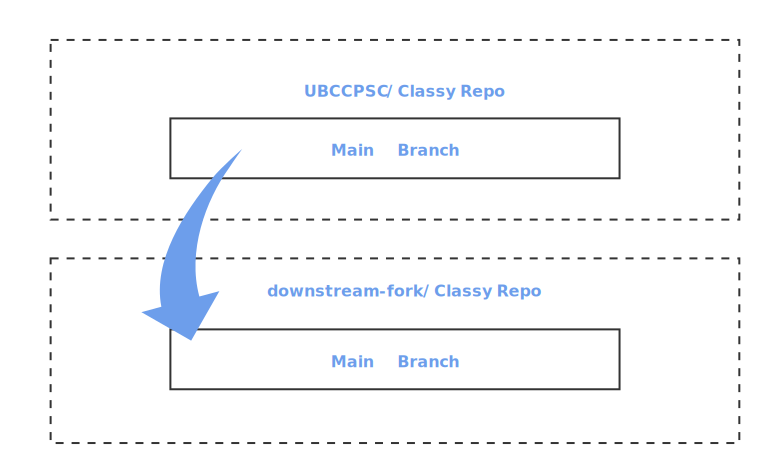
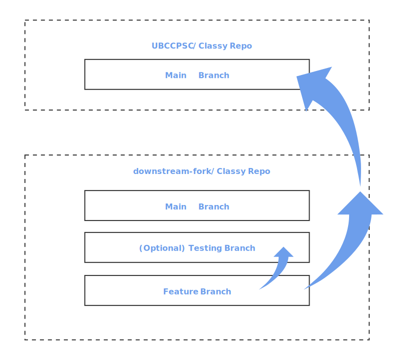

# Contributing to Classy Project

- [Contributing to Classy Project](#contributing-to-classy-project)
  - [Developer Contribution Acceptance Criteria](#developer-contribution-acceptance-criteria)
    - [Requirements](#requirements)
    - [Nice to Have's](#nice-to-haves)
  - [Local Development Fork Setup](#local-development-fork-setup)
  - [Remote Setup of a Fork](#remote-setup-of-a-fork)
  - [Modifying Classy on Your Fork](#modifying-classy-on-your-fork)
  - [Running Local Tests](#running-local-tests)
  - [Main repos](#main-repos)
  - [Goals](#goals)
    - [Pulling changes from `root/main` into `fork/main`](#pulling-changes-from-rootmain-into-forkmain)
    - [Pull-Requests from `fork` to `root/main`](#pull-requests-from-fork-to-rootmain)
    - [Node Library Dependencies](#node-library-dependencies)

All core Classy development will take place on [ubccpsc/classy](https://github.com/ubccpsc/classy). This repository will contain the base Classy image, but will not contain any course-specific code. Reid Holmes will act as the `ubccpsc/classy` custodian for evaluating and merging bug fix PRs as well as the feature-based PRs below.

A fork of the core Classy project, ([ubccpsc/classy](https://github.com/ubccpsc/classy), is required by any course that uses Classy. The fork is where custom development for a course can take place. If custom features are developed that suit the core project, the feature can be merged into the core project. Before setting up a pull-request, ensure that your code is in a feature branch and the branch is re-based to `ubccpsc/main`.

Forks are highly encouraged to issue PRs from their fork to `ubccpsc/classy` for any bug fixes; please make sure these fixes also pass the Classy test suite. The quality bar for these fixes will be high because we need to ensure they will not negatively impact other classes when they pull from upstream.

For new features, forks are also encouraged to issue PRs _during_ the term for consideration during the merging period. Again, since this code will be going into main, please make sure that:

* The new feature should have been validated 'in production' in the fork's current course instance; we want to know for sure that code has worked for another class before adding it to `ubccpsc/classy`.
* It makes sense for the functionality to be in `ubccpsc/classy` rather than the course-specific fork (e.g., the feature should have broad appeal to many other course instances).
* The feature is well tested and the code of high quality.
* Any additional tests do not overly burden the overall test suite execution duration, and should be resilient to future changes.
* The contribution must lint before it can be accepted (e.g., `cd classy/; yarn run lint`).

We will do our best to merge new features as long as they make sense for `ubccpsc/classy`, but if a feature is not merged it can exist as a long-lived feature in a course's fork. These features can also be merged between forks via PR as well if it makes sense to do so.

Main course forks:

* [ubccpsc210/classy](https://github.com/ubccpsc210/classy)
* [ubccpsc310/classy](https://github.com/ubccpsc310/classy)
* [secapstone/classy](https://github.com/SECapstone/classy)

## Developer Contribution Acceptance Criteria

The following guidelines can be helpful for evaluating any PRs on a local fork (although obviously these are up to the fork maintainer and will only be enforced if PRs are made back to `ubccpsc/classy`).

The test coverage of the system must be maintained; the expected coverage rate for any given file should be greater than 90%. We require tests be provided for any new contributions as without these it is extremely challenging to ensure that future development for other courses will not break your new contribution.

CircleCI testing [can be setup](docs/cirleCI.md) on a fork to ensure that coverage, test, and linting requirements are met. Constant notification of whether tests pass on each pushed change to your repository will help you discover and resolve conflicts between `ubccpsc` and the business logic of your fork quickly.

### Requirements

- [ ] Test coverage is over 90% with new features well-defined in test names
- [ ] Code is in a feature branch (ie. `feature/my-new-feature`)
- [ ] Code has been rebased to `ubccpsc/main`
- [ ] A pull-request has been created to `ubccpsc/main` from your feature branch
- [ ] Any new feature has been tested on a working branch on your fork repository
- [ ] Code passes all existing tests
- [ ] Pull-request passes CircleCI tests
- [ ] Code must pass linting with `yarn run lint` with no linting rule changes
- [ ] README has been updated with an example of the feature

### Nice to Have's

- [ ] No new node libraries are introduced
- [ ] No new line spacing introduced
- [ ] Code has been reviewed in pull-request prior to pull-request to `ubccpsc/main`

```bash
# if you made some changes and forgot to branch:
git stash
git checkout -b <DESCRIPTIVE_BRANCH_NAME>
git stash pop
git commit -a
git push --set-upstream origin <DESCRIPTIVE_BRANCH_NAME>

# if you didn't forget to branch first:
git checkout -b <DESCRIPTIVE_BRANCH_NAME>
git commit -a
git push --set-upstream origin <DESCRIPTIVE_BRANCH_NAME>
```

## Local Development Fork Setup

This only needs to happen once per fork, so if you already have a configured fork with a sync branch, you can ignore this step.

1. Fork `root` into a GitHub account you control (hereby called the `fork`).
2. Create a branch called `sync` on your `fork` (`git branch sync`) and create `fork/sync` on the server (`git push origin sync`).
3. Add the upstream branch `git remote add upstream https://github.com/ubccpsc/classy.git` ([LINK](https://help.github.com/articles/configuring-a-remote-for-a-fork/)).

## Remote Setup of a Fork

Technical staff will configure a fork of [ubccpsc/classy](https://github.com/ubccpsc/classy) for each course that uses Classy. If you do not have a fork for your course, please request that a fork is configured for your course by contacting your instructor. Your instructor will be able to request that a fork is configured for a course from technical staff.

## Modifying Classy on Your Fork

During the term, `ubccpsc/classy` will only receive critical bug fixes so courses should feel comfortable pulling these into their forks if the bug fixes are relevant to them. Major changes will only be made to `ubccpsc/classy` during exam breaks (e.g., December, April, and August).

Custom changes can be made to code in your fork, but the custom changes should **NOT** be pushed back to the root `Classy` repository, unless it is a needed feature.

## Running Local Tests

Both AutoTest and Classy have extensive test suites. While these will be run by CI, during development you usually want to run them locally.
To do this you need to do two things:
1. Ensure you have a local mongo instance running (see `DB_URL` in `.env`).
   In a terminal, run: `docker run -p 27017:27017 mongo`
1. Have a test profile in your IDE that runs the tests. In Webstorm, this is done by creating a Mocha target with node options `--require dotenv/config -r tsconfig-paths/register` as the node options and the test directory pointed to the relevant test parent for the project. You will also want to set `Compile typescript` as a before launch action.
1. Ensure you have a valid `.env` file in the root of the project. You can copy the `.env.example` file and fill in the values.

## Main repos

* `ubccpsc/classy/main` (hereby `root`) is the core project that repos pull stable code from
* `<user>/classy/main` (hereby `fork`) is where classes are going to want to work (there will be many of these `fork` repos)

## Goals

* `fork/main` needs be able to make any changes it needs during the term without impacting `root/main`
* `fork/main` needs to be able to accept critical patches during the term from `root/main`
* `fork/main` needs be able to accept new feature changes at the end of the term, but only a ***subset*** of commits
* `fork/main` needs to be able to contribute changes to `root/main`

### Pulling changes from `root/main` into `fork/main`

This can happen regularly, whenever there is a `root/main` change that fixes a bug or adds a feature that the fork might want.

On `fork`:

1. `git checkout main`
2. `git fetch upstream` (pulls down the changes from `root/main` to your local repo).
3. `git merge upstream/main` (merges the changes into your local repo).
4. `git push` (pushes the changes from your local repo to its remote GitHub repo).



### Pull-Requests from `fork` to `root/main`

On `fork`:

This is ***not*** likely to happen during the term, except for critical patches, but it _is_ likely to happen at the end of the term when new features should be upstreamed to `root`. If you are doing a lot of development with multiple features, you should avoid merging your changes into your `main` branch. Instead, try to create a testing or release branch to run your modified code in.



### Node Library Dependencies

Please minimize external package dependencies. Classy has been configured to use [yarn workspaces](https://yarnpkg.com/lang/en/docs/workspaces/#toc-how-to-use-it).
You should add global dependencies to the root `package.json` and package-specific dependencies in the package-level `package.json`.

Specific development instructions are included in [`packages/portal/backend/README.md`](packages/portal/backend/README.md), [`packages/portal/frontend/README.md`](packages/portal/frontend/README.md), and [`packages/autotest/README.md`](packages/autotest/README.md).

### Examining a remote Mongo store

You should not need to check the deployed mongo database, but if you do it is possible to examine. The easiest way is using Robo3T. Configure a connection as follows:

* Connection_Type: `direct`
* Connection_Address: `localhost`
* Connection_Port: `27017`
* Authentication_Database: `admin`
* Authentication_UserName: `<from .env>`
* Authentication_Password: `<from .env>`
* SSH_Tunnel: `<check>`
* SSH_Address: `<deployed host>`
* SSH_User: `<your username>`
* SSH_Auth: `Private key` (needs to be configured on server)
* SSH_Private: `<path to private key>`

After this configuration, 'Test config' should tell you that it is working. This skips the need to configure SSH tunnels, but you may need to be on the appropriate VPN for this to all work.
