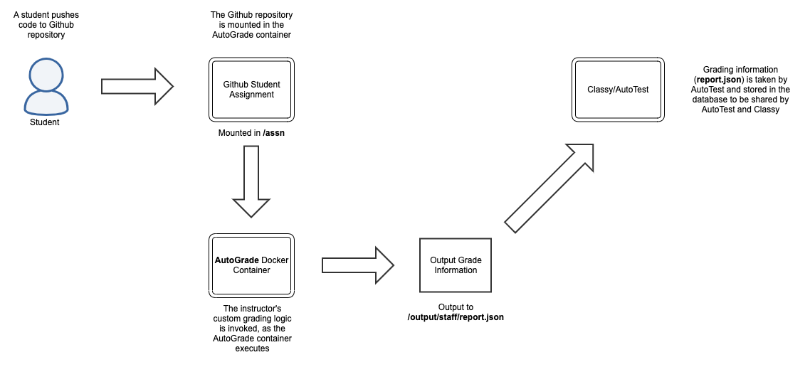
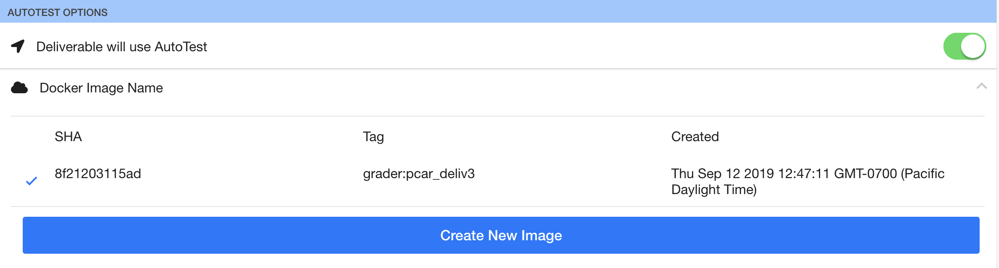
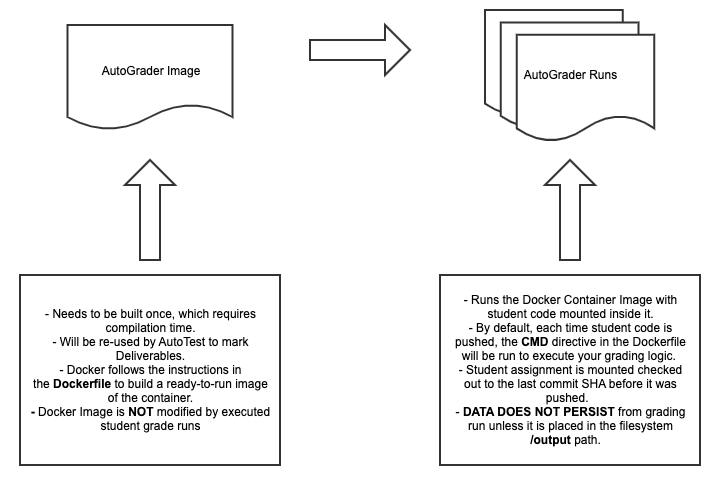
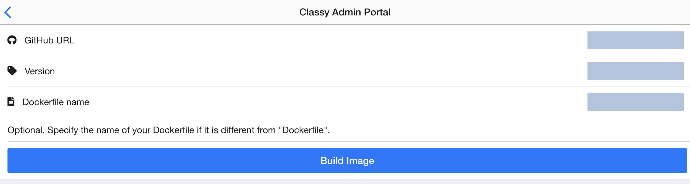
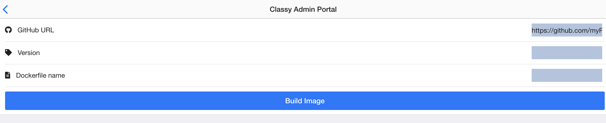

# Instructor: Build and Integrate an AutoGrade Container

## Overview

Classy can automatically grade student code by running Docker containers that are designed to produce grade output data. `AutoTest` is an application inside Classy that starts a container each time a student pushes code to a repository. The student code is mounted to a disk volume inside the container, which allows a script to run with instructions on how to mark student code. When the script produces grade output data, the data is taken from the container, which AutoTest then sends to a database. Classy reads from the database to present the compiled grade records to instructors in the front-end application.



To create an AutoGrade Container, follow the [Build a Container Checklist](#build-a-container-checklist). Your grading business logic should be implemented on top of the container technical requirements. Click on the headers in the checklist to learn more context about the technical requirements.

## Build a Container Checklist

This checklist ensures that you have implemented key technical and business logic requirements that ensure your AutoGrade container is functional after it is built in an AutoTest environment:

### [Container Input](#container-input-details)

- [ ] Your grading logic assumes that the student code is found in the `/assn` path when the container runs.
- [ ] Your grading logic assumes that the code in the `/assn` directory is checked out to the SHA of the last commit before the push.
- [ ] If necessary for your course Business Logic, you implement the following environment variables:
  - ASSIGNMENT: the deliverable name of the assignment that is running.
  - EXEC_ID: an always unique execution SHA produced each time a container runs.

### [Container Output](#container-output-details)

- [ ] Your container logic assumes that output data is put in the `/output` path following the user-role sub-directory convention:
  - **../admin/**
  - **../staff/**
  - **../student/**
- [ ] /output/staff sub-directory contains:
  - **report.json** grading file at the end of a grading run
  - additional files that TAs and instructors need access to after the grading run
- [ ] The **report.json** file is valid JSON that follows this Report Schema: https://github.com/ubccpsc/classy/blob/956e78328c14146e2246b89f1fe0c6e60cb689ed/packages/common/types/ContainerTypes.ts#L69-L106.
- [ ] Your container logic assumes that if code stalls, encounters an infinite loop, or the container times out, Classy will provide this default report.json file: https://github.com/ubccpsc/classy/blob/master/packages/autotest/src/autotest/GradingJob.ts#L28-L40.
- [ ] You container logic assumes that any data that is NOT output to the appropriate `/output` path WILL BE LOST FOREVER after a grading run finishes.

### [Dockerfile](#dockerfile-explained)

- [ ] **FROM** directive is declared with an operating system and/or additional packages installed to run your business logic.
- [ ] **RUN** chmod directive is declared that sets necessary permissions on files copied into your image*
    *644  (-rw-r — r — ) owned by root is default when copying files into an image using the COPY directive
- [ ] **COPY** directive is declared to copy any files cloned from your Git repository to your container.
- [ ] **CMD** directive is declared to trigger your AutoGrade grading logic each time the container is started by AutoTest

### [Dockerfile Github Repository](#autograde-dockerfile-repository)

- [ ] Dockerfile is named `Dockerfile` by default or customized.
- [ ] Dockerfile is located in the root path of the filesystem of the Git repository or syntax to specify sub-directories in Classy clone address is understood.
- [ ] Choose one:
  - Git repository is publicly accessible to be cloned by Classy
  - Git repository is privately accessible and a Github token has been given to technical staff to be added to the Classy environmental configuration file.
- [ ] If sharing a Classy instance with instructors, the other instructors can also use the same Github token to setup their AutoGrade containers**.

**NOTE:** A Classy instance can only have a single Github clone token that clones AutoGrade repositories that contain Dockerfiles. Hence, this token must be shared by instructors of a course that offers more than one section within a single Classy instance.

## Test a Container Checklist

Docker containers are notoriously difficult to debug. It is highly recommended that you test the grading logic of your container against an example assignment in development, staging, and production environments.

### Development Environment

- [ ] Ensure that Docker is running on your computer.
- [ ] Enter the directory where the Dockerfile is located.
- [ ] Build your container in your own environment with the command:
  - `docker build . --tag grader`
  - You **SHOULD NOT** see any build errors. As a sanity check, you may use the `docker images` command to verify that an image is built with the tag 'grader'.
- [ ] Create a mock submission of some student work in a directory. The submission should mimic the student assignment file structure that you expect the student to submit the assignment in.
- [ ] Run the *grader* container with the following filesystem mounts (replace absolute path with your local path): 
  - `/Users/tsmith/Desktop/mockAssnDir:/assn`               <--- Contains Mock Submission
  - `/Users/tsmith/Desktop/mockAssnOutput:/ouput`           <--- Contains a **/staff**, **/admin**, and **/student** sub-directory.
  - Run container with volume mounts example: `docker run -it -v /Users/tsmith/Desktop/mockAssnDir:/assn -v /Users/tsmith/Desktop/mockAssnOutput:/output grader`

**NOTE:** It becomes difficult to debug and inspect your container if the container filesystem is inaccessible because you are using a minimal Linux distribution image that does not have Bash or Ash installed. It is highly recommended that you install a command line tool, as part of the Dockerfile instructions, to allow for easier debugging by manually running commands and viewing the filesystem within the container.

- [ ] The report.json file in valid JSON format in the local environment is found in the /output/staff directory.
- [ ] Files that your TAs need to access are available in the /output/staff directory.
- [ ] Files that instructors need to access are available in the /output/admin directory.
- [ ] Files that students need to access are available in the /output/student directory.
- [ ] If you are unable to achieve the results above, attempt to debug your container using the following command: `docker run -it grader bash`.
- [ ] If any of the steps in the tests have resulted in the unintended results, remove the container (command: docker rmi grader -f), implement a fix, and restart the tests.

### Staging Environment

- [ ] Create an example Deliverable on Classy Development: https://classy-dev.students.cs.ubc.ca.
- [ ] Under the Deliverable, verify that you can build your container on Classy Development (see image).
- [ ] Provision a repository with a test user using a boilerplate starter assignment.
- [ ] Test changes to the starter assignment to ensure that the expected results are produced by AutoTest.

You should see the following checkmark to the left of an AutoGrade image when a container is successfully assigned to a Deliverable:


### Production Environment

Follow the steps from Staging in Production on your course Classy server (ie. cs210.students.ubc.ca).

## Dockerfile Explained

A Dockerfile MUST be written to create a Docker image; As an AutoGrade container is a Docker image, a Dockerfile is necessary to build a custom AutoGrade container. A Dockerfile contains steps to build a container, which involves downloading dependencies, compiling and installing code, so that is ready to execute a command without loading time. 

We leverage the Docker build logic above to build our grading container. As the data from these build steps is saved into a pre-compiled and runnable Docker image, AutoTest now listens for Github notification web-hooks that tell it if a student has pushed code to their Github repository. If a Deliverable in Classy is configured to run an AutoGrade container, and AutoTest receives a push notification, AutoTest triggers the Docker container to run. The CMD directive in your Dockerfile will run each time that a student pushes code to their Github repository with the assignment mounted inside the container. Any output that must be archived MUST be put in the Container Output filesystem path to ensure that it is not lost after the container finishes executing its script.

The original AutoGrade image data will NOT be modified during each AutoGrade run. The data produced when the AutoGrade container is run will NOT persist after the container completes its grading run. The grading run ends as soon as the container encounters an unhandled exception, a timeout, or the CMD directive fails or successfully runs to completion. ONLY data that is moved to the Container Output path of your AutoGrade directory will persist after the container completes its run.

**NOTE:**
- A container must be **BUILT** to create an image of your AutoGrade logic that it can repeatedly **RUN**.
- When a Docker image runs in AutoTest, it executes the file to the right of the **CMD** directive to run your container.
- The **CMD** directive should result in the output of a report.json file each time your container is run (unless it encounters an error).



### Helpful Dockerfile directives

**FROM** - Used to retrieve a Docker image base. Many Linux distributions exist, as well as a very minimal Alpine Linux distribution that is approximately 8MB.
**WORKDIR** - Set the working path that your Docker directives run from.
**RUN** - An API to the command line of your operating system console.
**COPY** - Allows you to copy files from the Git repository where your Dockerfile is kept, or somewhere else on the Docker HOST of your course, into the Docker container to be accessible during the AutoGrade container runtime.
**CMD** - This is the most important directive of your Docker container, as this is the command that is run when Autotest starts your container run.

**WARNING - Operating Systems:**
Only Linux distributions have been tested with Classy. While Windows distributions may work, the volume mounting, formatting, and file permissions is untested with Classy. It is highly recommended that you start with Linux. Please speak with Reid Holmes if you need to use a Windows distribution.

### Steps to build a Docker image

Declare **FROM** to select an operating system distribution that the container environment can run. (**REQUIRED**)
Declare **WORKDIR** to set a working path that your Docker directives will be run from. (**OPTIONAL**)
Declare **RUN** to invoke any commands to update or install packages, just as you would on any Linux or Windows command line. (**OPTIONAL**)
Declare **COPY** to move files into your AutoGrade container, where they will be available to your grading logic, when you start the container. (**OPTIONAL**)
Declare **CMD** to declare what file should be executed each time AutoTest starts your container. You can assume that the student assignment has been mounted into the container at this point. (**REQUIRED**)

Example of a Dockerfile that builds a basic AutoGrade container to produce hardcoded output (MVP full boilerplate source-code: [https://github.com/ubccpsctech/autograder_io_basic_example](https://github.com/ubccpsctech/autograder_io_basic_example))

```
## Pre-compiled Linux distributions with pre-installed Node JS, Java, Python, etc. are available.
## https://hub.docker.com/search/?type=image
FROM debian:wheezy

WORKDIR /app

## Install any dependencies needed to mark your code using a package manager compatible with your Linux distribution
RUN apt-get update
RUN apt-get install git

COPY exampleFiles/markAssn.sh /app/markAssn.sh

## Set chmod -R 777 on your work directory to ensure that AutoTest can read the data
RUN chmod -R 777 .

## CMD will trigger once student code is pushed to a repository.
CMD ["/app/markAssn.sh"]
```

### Container Input Details

The container input is the student assignment and two environment variables. AutoTest mounts student code from a Github repository into the **/assn** directory of a container each time that AutoGrade starts a container. Your programming logic can assume that the **/assn** directory will me accessible instantly and the assignment is checked-out to the SHA of the commit before the code was pushed to Github. The **.git** folder is included in the assignment directory, which allows the instructor to use additional Git commands to access historical commits of the code. Your container will need Git to be installed before you can access the Git commands. You can specify the installation steps in the Dockerfile.

AutoTest will also input two environment variables that you can use to customize or automate features of your grading logic. These are optional environment variables that are not necessary to implement in your container.

- Input Assignment Location
  - **/assn**

- Input Environment Variables
  - **ASSIGNMENT**: string = The name of the deliverable
  - **EXEC_ID**: string = The Docker container execution ID (long random SHA)

### Container Output Details

While AutoTest provides input for your AutoGrade container, it is the responsibility of the instructor to provide output data for AutoTest to consume and persist. Data that is not properly managed will BE LOST FOREVER after a grading run is completed. At a bare minimum, the output data must contain a report.json file that tells AutoTest the grade results of the container run. A stdio.txt file will be produced automatically by AutoTest. If good log information is output to the console, AutoTest will automatically record the output data and store it for you. However, you may also choose to implement custom logging and output it to the /output/admin or /output/staff directories.

#### Output Filesystem Paths

- **/output/staff** ← {report.json} and any private staff resources.
- **/output/admin** ← Any private instructor resources 
- **/output/student **← Files that a student is allowed to see after a grading run

### AutoGrade Dockerfile Repository

AutoTest needs a place to access the Dockerfile, and additional files, to build an AutoGrade container. The minimum technical requirement to build an AutoGrade container is to produce a Dockerfile. A Dockerfile must be placed in the root directory of a Git repository. Alternative names may be given to the Dockerfile, but the alternative name must be specified during the creation of the AutoGrade container.

*Specify a custom Dockerfile name in 'Dockerfile name'*:


*Specify a sub-directory location of your Dockerfile with the following # syntax in 'Github URL' (URL cutoff in UI example: ie. https://github.com/myRepositoryName/example.git#:myFilePath)*

