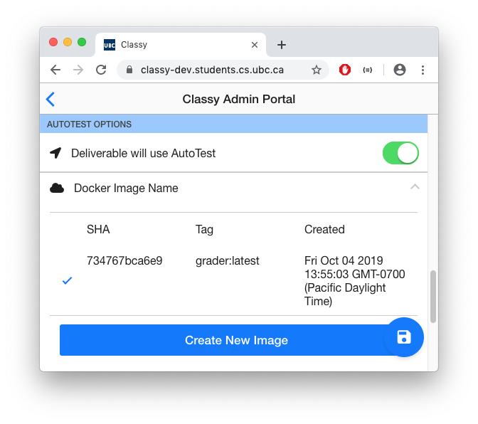
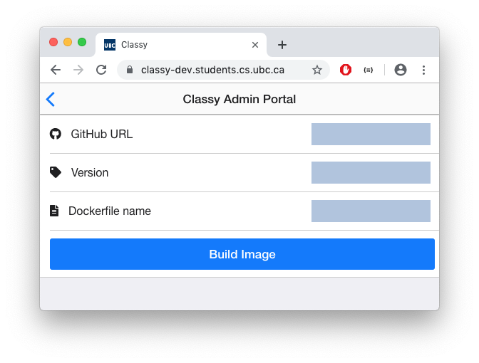

# Instructor: Build and Integrate an AutoGrade Container

<!-- TOC depthfrom:2 -->
- [Instructor: Build and Integrate an AutoGrade Container](#instructor-build-and-integrate-an-autograde-container)
  - [Overview](#overview)
  - [Development Checklist](#development-checklist)
    - [Container Input](#container-input)
    - [Container Output](#container-output)
    - [Dockerfile](#dockerfile)
    - [Dockerfile Github Repository](#dockerfile-github-repository)
  - [QA Container Checklist](#qa-container-checklist)
    - [Development Environment](#development-environment)
    - [Staging Environment](#staging-environment)
    - [Production Environment](#production-environment)
  - [Dockerfile Explained](#dockerfile-explained)
    - [Helpful Dockerfile Directives](#helpful-dockerfile-directives)
    - [Steps to build a Docker image](#steps-to-build-a-docker-image)
    - [Container Input Details](#container-input-details)
    - [Container Output Details](#container-output-details)
      - [Output Filesystem Paths](#output-filesystem-paths)
    - [AutoGrade Dockerfile Repository](#autograde-dockerfile-repository)
<!-- /TOC -->

## Overview

`AutoTest` can grade an assignment each time a student pushes code to a Github repository. The student code is mounted to a constant location, inside the container, which allows customized scripts to execute tests against it. When the script produces grade output data based on instructor criteria, the grade information is taken by AutoTest to be stored in the database. The grade records accumulate in the database, as they are produced in every successful grading run. Grading runs can occur each time a student pushes code or only when a student requests a grade. If a grade is requested by a student for a commit, feedback for the student produced in the container, is posted to the student in their Github repository.


## Development Checklist

This checklist ensures that you have implemented key technical and business logic requirements that ensure your AutoGrade container is functional once integrated with AutoTest:

### [Container Input](#container-input-details)

- [ ] Your container assumes that the student code is mounted in the `/assn` path when the container starts.
- [ ] Your container assumes that the code in the `/assn` directory is checked out to the SHA of the last commit before the push.
- [ ] If necessary for your course logic, you implement the following environment variables:
  - ASSIGNMENT: the deliverable name of the assignment that is running.
  - EXEC_ID: an always unique execution SHA produced each time a container runs.
  - INPUT: Stringified JSON that contains lots of non-necessary but potentially useful fields.

### [Container Output](#container-output-details)

- [ ] Your container logic places any output data, if it needs to persist, in the `/output` path following this convention:
  `/output/admin/`
  `/output/staff/`
  `/output/student/`
- [ ] `/output/staff` sub-directory contains:
  - `report.json` grading file at the end of a successful grading run that exits with a success `0` exit code.
  - additional files that TAs and instructors need access to after the grading run.
- [ ] The `report.json` file is valid JSON that follows the [Report Schema](https://github.com/ubccpsc/classy/blob/master/packages/common/types/ContainerTypes.ts#L72-L115).
- [ ] References to attachments are recorded in the `attachments` property of the `report.json` following the [Attachment Schema](https://github.com/ubccpsc/classy/blob/20bbcc6bc3b3adde0b84a70803605e866ba1e10f/packages/common/types/ContainerTypes.ts#L123-131).
- [ ] Your container logic assumes that if code stalls, encounters an infinite loop, or the container times out, (non-0 exit code) Classy will provide this [default report.json file](https://github.com/ubccpsc/classy/blob/master/packages/autotest/src/autotest/GradingJob.ts#L123-L131).
- [ ] You container logic assumes that any data that is NOT output to the appropriate `/output` path WILL BE LOST FOREVER after a grading run finishes.

### [Dockerfile](#dockerfile-explained)

- [ ] **FROM** directive is declared with an operating system and/or additional packages installed to run your business logic.
- [ ] **RUN** chmod directive is declared that sets necessary permissions on files copied into your image.
    *644  (-rw-r — r — ) owned by root is default when copying files into an image using the COPY directive.
- [ ] **COPY** directive is declared to copy any files cloned from your Git repository to your container.
- [ ] **CMD** directive is declared to trigger your AutoGrade grading logic each time the container is started by AutoTest.

### [Dockerfile Github Repository](#autograde-dockerfile-repository)

- [ ] Dockerfile is named `Dockerfile` and placed in root directory of repository by default or customized with [Build Syntax Suffix](https://docs.docker.com/engine/reference/commandline/build/)
- [ ] Your Dockerfile and assets are stored in Git repository:
  - Git repository is publicly accessible to be cloned by Classy.
    OR
  - Git repository is privately accessible and a Github token has been given to technical staff to be added to the Classy environmental configuration file.
- [ ] If sharing a Classy instance with instructors, the other instructors can also use the same Github token to setup their AutoGrade containers.

**NOTE:** A Classy VM can only have a **ONE** Github clone token. All private Dockerfile repositories must ensure that this token authorizes access to all relevant repositories.

## QA Container Checklist

Docker containers are notoriously difficult to debug. It is highly recommended that you test the grading logic of your container against an example assignment in development, staging, and production environments.

### Development Environment

- [ ] Ensure that Docker is running on your computer.
- [ ] Enter the directory where the Dockerfile is located.
- [ ] Build your container in your own environment with the command:
  - `docker build . --tag grader`
  - You **SHOULD NOT** see any build errors. As a sanity check, you may use the `docker images` command to verify that an image is built with the tag 'grader'.
- [ ] Create a mock submission of some student work in a directory. The submission should mimic the student assignment file structure that you expect the student to submit the assignment in.
- [ ] Run the *grader* container with the following filesystem mounts (replace absolute path with your local path):
  - `/Users/tsmith/Desktop/mockAssnDir:/assn`               <--- Contains Mock Submission
  - `/Users/tsmith/Desktop/mockAssnOutput:/ouput`           <--- Contains a `/staff`, `/admin`, and `/student` sub-directory.
  - Run container with volume mounts example: `docker run -it -v /Users/tsmith/Desktop/mockAssnDir:/assn -v /Users/tsmith/Desktop/mockAssnOutput:/output grader`

**NOTE:** It becomes difficult to debug and inspect your container if the container filesystem does not have Bash or Ash installed. It is highly recommended that you install a command line tool, as part of the Dockerfile instructions, to allow for easier debugging by manually running commands and viewing the filesystem within the container.

- [ ] The report.json file in valid JSON format in the local environment is found in the `/output/staff` directory.
- [ ] Files that your TAs need to access are available in the `/output/staff` directory.
- [ ] Files that instructors need to access are available in the `/output/admin` directory.
- [ ] Files that students need to access are available in the `/output/student` directory.
- [ ] If you are unable to achieve the results above, attempt to debug your container using the following command: `docker run -it grader bash`.
- [ ] If any of the steps in the tests have resulted in the unintended results, remove the container (command: `docker rmi grader -f`), implement the fix, re-build the container and restart the tests.

### Staging Environment

- [ ] Create an example Deliverable on [Classy Development](https://classy-dev.students.cs.ubc.ca).
- [ ] Under the Deliverable, verify that you can build your container on Classy Development (see image).
- [ ] Provision a repository with a test user using a boilerplate starter assignment.
- [ ] Test changes to the starter assignment to ensure that the expected results are produced by AutoTest.

You should see the following checkmark to the left of an AutoGrade image when a container is successfully assigned to a Deliverable:



### Production Environment

Follow the steps from Staging in Production on your course Classy server (ie. cs210.students.ubc.ca).

## Dockerfile Explained

A Dockerfile contains steps to build a container, which involves downloading dependencies, compiling and installing code, so that a built image is ready to perform a task during execution time. As an AutoGrade container is a Docker image, and a Dockerfile must be written to create a Docker image, a Dockerfile must be written to create an AutoGrade image.

AutoTest listens for Github web-hooks to detect if a student has pushed code to their Github repository. If a deliverable, in Classy, is configured to run an AutoGrade container, and AutoTest receives a push notification, AutoTest executes the Docker container. The `CMD` directive in your Dockerfile is the command that executes, in the pre-built image, each time that student code is ready to be graded.

The AutoGrade image that is built will NOT be modified during each grading run. The data produced during the container runtime will also NOT persist after the container completes its grading run, unless data to be persisted is moved to the correct filesystem path. The grading run ends as soon as the container encounters an unhandled exception, a timeout, or the CMD directive fails or successfully runs to completion. ONLY data that is moved to the Container Output path of your AutoGrade directory will persist after the container completes its run.

**NOTE:**
- A container must be **BUILT** to create an image of your AutoGrade logic that it can repeatedly **RUN**.
- When a Docker image runs in AutoTest, it executes the file declared with the **CMD** directive in your Dockerfile.
- The **CMD** directive must create a `report.json` file output of a report.json file each time your container is run (unless it encounters an error).


### Helpful Dockerfile Directives

**FROM** - Used to retrieve a Docker image base. Many Linux distributions exist, as well as a very minimal Alpine Linux distribution that is approximately 8MB.
**WORKDIR** - Set the working path that your Docker directives run from.
**RUN** - An API to the command line of your operating system console.
**COPY** - Allows you to copy files from the Git repository where your Dockerfile is kept, or somewhere else on the Docker HOST of your course, into the Docker container to be accessible during the AutoGrade container runtime.
**CMD** - This is the most important directive of your Docker container, as this is the command that is run when Autotest starts your container run.

**WARNING - Operating Systems:**
Only Linux distributions have been tested with Classy. While Windows distributions may work, the volume mounting, formatting, and file permissions is untested with Classy. It is highly recommended that you start with Linux. Please speak with Reid Holmes if you need to use a Windows distribution.

### Steps to build a Docker image

- [ ] Declare **FROM** to select an operating system distribution that the container environment can run. (**REQUIRED**)
- [ ] Declare **WORKDIR** to set a working path that your Docker directives will be run from. (**OPTIONAL**)
- [ ] Declare **RUN** to invoke any commands to update or install packages, just as you would on any Linux or Windows command line. (**OPTIONAL**)
- [ ] Declare **COPY** to move files into your AutoGrade container, where they will be available to your grading logic, when you start the container. (**OPTIONAL**)
- [ ] Declare **CMD** to declare what file should be executed to start the grading logic in the grading container. (**REQUIRED**)

Example of a Dockerfile that builds a basic AutoGrade container to produce hardcoded output (MVP full boilerplate source-code: [https://github.com/ubccpsctech/autograder_io_basic_example](https://github.com/ubccpsctech/autograder_io_basic_example))

```Dockerfile
    ## Pre-compiled Linux distributions with pre-installed Node JS, Java, Python, etc. are available.
    ## https://hub.docker.com/search/?type=image
    FROM debian:wheezy

    WORKDIR /app

    ## Install any dependencies needed to mark your code using a package manager compatible with your Linux distribution
    RUN apt-get update
    RUN apt-get install git

    COPY exampleFiles/markAssn.sh /app/markAssn.sh

    ## Set chmod -R 777 on your work directory to ensure that AutoTest can read the data
    RUN chmod -R 777 .

    ## CMD will trigger once student code is pushed to a repository.
    CMD ["/app/markAssn.sh"]
```

### Container Input Details

AutoTest mounts and checks out student code to the latest commit, at the time when the code was pushed to Github, inside an AutoGrade container to make it accessible for marking. The assignment can be found in the `/assn` directory of the container every grading run. Therefore, your programming logic should assume that the `/assn` directory contains the student assignment. The `.git` folder is included in the assignment directory, which allows the instructor to use additional Git commands to access Git history. Remember to install Git in your container before using Git commands.

AutoTest also inputs two environment variables that you can use to customize or automate features of your grading logic. These are optional environment variables that are not necessary to implement in your container.

- Input Assignment Location
  - **/assn**

- Input Environment Variables
  - **ASSIGNMENT**: string = The name of the deliverable
  - **EXEC_ID**: string = The Docker container execution ID (long random SHA)
  - **INPUT**: string = JSON stringified input data
    - **ContainerInput** [Schema](https://github.com/ubccpsc/classy/blob/master/packages/common/types/ContainerTypes.ts#L14-L21)
      - **CommitTarget** [Schema](https://github.com/ubccpsc/classy/blob/master/packages/common/types/ContainerTypes.ts#L36-L59)
      - **AutoTestConfigTransport** [Schema](https://github.com/ubccpsc/classy/blob/master/packages/common/types/PortalTypes.ts#L183-L230)

### Container Output Details

Container output is data produced by a grading run that a course decides to retain. Output data can be accessed by the URL convention: `https://{course}.students.cs.ubc.ca/portal/resource/{$EXEC_ID}/{admin, staff, or admin}/{filename.xyz}`.

ie. `https://cs999.students.cs.ubc.ca/portal/resource/08dcb3a38c6aa3ccc556385b87cc13c8d3e0baf5-lab2/student/additional_feedback.txt`.

The URL is a protected route accessible by authorized users. A student may only access files from the `student` folder, while admins may access all folders, etc.

Output files that are created by your container should be documented in the `attachments` attribute in the `report.json` file, but it is optional to document the persistant files. The `attachments` attribute allows one to also document the user type that has access to files. If there is a need to do data analysis, these fields may be beneficial, as one does not have to look for files manually in the filesystem where persistant data is archived after the school semester ends.

AutoTest provides input for your AutoGrade container, but it is the responsibility of the instructor to provide output data for AutoTest to consume and persist. Data that is not properly managed will BE LOST FOREVER after a grading run is completed. At a bare minimum, the output data must contain a report.json file that tells AutoTest the grade results of the container run. A `stdio.txt` file will be produced automatically by AutoTest. If log information is output to the console in your container, AutoTest will automatically record the output data and store it for you. However, you may also choose to implement custom logging and output it to the `/output/admin` or `/output/staff` directories with a user role perspective in mind.

#### Output Filesystem Paths

- `/output/staff` ← {report.json} and any private staff resources.
- `/output/admin` ← Any private instructor resources
- `/output/student` ← Files that a student is allowed to see after a grading run

### AutoGrade Dockerfile Repository

AutoTest needs access to the Dockerfile, with any additional supporting files, to build an AutoGrade container. A Dockerfile must be placed in the root directory of a Git repository. Alternative names may be given to the Dockerfile, but the alternative name must be specified during the creation of the AutoGrade container.

*Specify a custom Dockerfile name in 'Dockerfile name'*:



*Specify a sub-directory location of your Dockerfile with the following # syntax in 'Github URL' (URL cutoff in UI example: ie. https://github.com/myRepositoryName/example.git#:myFilePath)*


