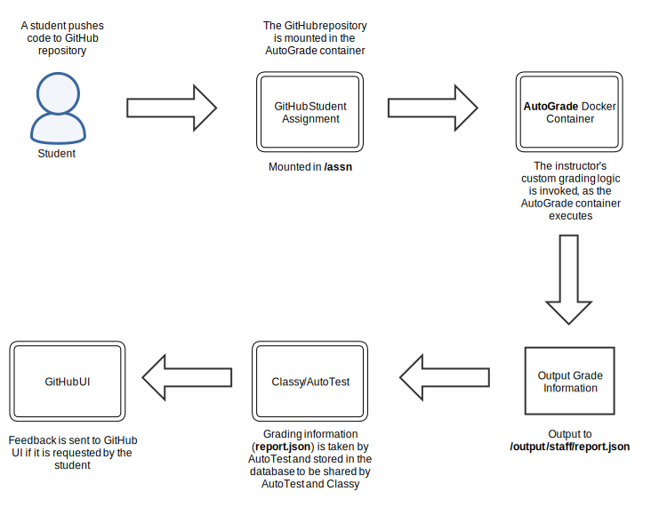

# Instructor AutoGrade Creation Manual

Classy can automatically grade student code by running Docker containers that are designed to produce grade output data. `AutoTest` is an application inside Classy that starts a container each time a student pushes code to a repository. The student code is mounted to a disk volume inside the container, which allows a script to run with instructions on how to mark student code. When the script produces grade output data, the data is taken from the container, which AutoTest then sends to a database. Classy reads from the database to present the compiled grade records to instructors in the front-end application.

To create an AutoGrade Container, follow the AutoGrade Technical Requirements Checklist. Your grading business logic should be implemented on top of the container technical requirements. Click on the headers in the checklist to learn more context about the technical requirements.

## AutoGrade Technical Requirements Checklist

This checklist ensures that you have implemented key technical and business logic requirements that ensure your AutoGrade container is functional after it is built in an AutoTest environment:

### Container Input

- [ ] Your grading logic assumes that the student code is found in the `/assn` path when the container runs.
- [ ] Your grading logic assumes that the code in the `/assn` directory is checked out to the SHA of the last commit before the push.
- [ ] If necessary for your course Business Logic, you implement the following environment variables:
    ASSIGNMENT: the deliverable name of the assignment that is running.
    EXEC_ID: an always unique execution SHA produced each time a container runs.

### Container Output

- [ ] Your container logic assumes that output data is put in the `/output` path following the user-role sub-directory convention:
    ../admin/
    ../staff/
    ../student/
- [ ] /output/staff sub-directory contains:
    report.json grading file at the end of a grading run
    additional files that TAs and instructors need access to after the grading run
- [ ] The report.json file is valid JSON that follows this Report Schema: https://github.com/ubccpsc/classy/blob/956e78328c14146e2246b89f1fe0c6e60cb689ed/packages/common/types/ContainerTypes.ts#L69-L106.
- [ ] Your container logic assumes that if code stalls, encounters an infinite loop, or the container times out, Classy will provide this default report.json file: https://github.com/ubccpsc/classy/blob/master/packages/autotest/src/autotest/GradingJob.ts#L28-L40.
- [ ] You container logic assumes that any data that is NOT output to the appropriate `/output` path WILL BE LOST FOREVER after a grading run finishes.

### Dockerfile

- [ ] `FROM` directive is declared with an operating system and/or additional packages installed to run your business logic.
- [ ] `RUN` chmod directive is declared that sets necessary permissions on files copied into your image*
    *644  (-rw-r — r — ) owned by root is default when copying files into an image using the COPY directive
- [ ] `COPY` directive is declared to copy any files cloned from your Git repository to your container.
- [ ] `CMD` directive is declared to trigger your AutoGrade grading logic each time the container is started by AutoTest

Dockerfile Github Repository

- [ ] Dockerfile is named 'Dockerfile' by default or customized.
- [ ] Dockerfile is located in the root path of the filesystem of the Git repository or syntax to specify sub-directories in Classy clone address is understood.
- [ ] Choose one:
    Git repository is publicly accessible to be cloned by Classy
    Git repository is privately accessible and a Github token has been given to technical staff to be added to the Classy environmental configuration file.
- [ ] If sharing a Classy instance with instructors, the other instructors can also use the same Github token to setup their AutoGrade containers**.

    ** A Classy instance can only have a single Github clone token that clones AutoGrade repositories that contain Dockerfiles. Hence, this token must be shared by instructors of a course that offers more than one section within a single Classy instance.
