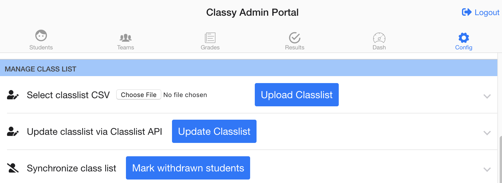
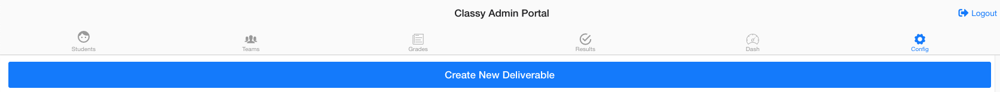
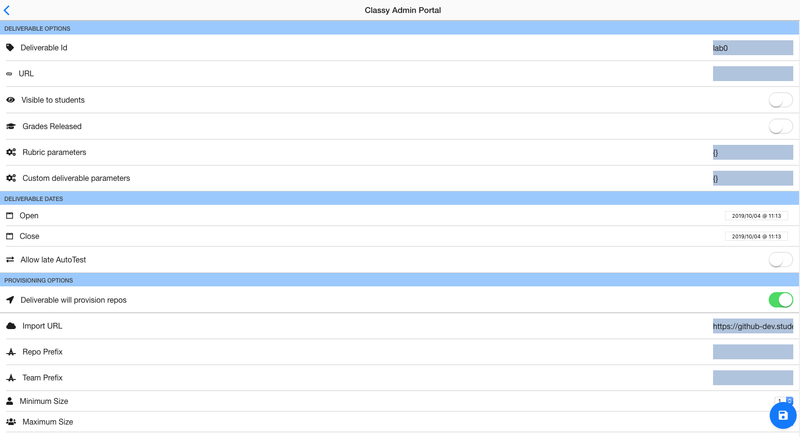

# Course Instructions

## Overview

AutoTest configurations allow for the unique delivery of course content based on course requirements. The configuration steps below give you basic introduction to steps for a typical course delivery. For further insight into a step, a user can click on the UI header to see more detailed instructions.

## Classlist Enrollment

Classy does not automatically know what students are enrolled in your course. An API endpoint with student information has been integrated with Classy that allows it to access the *current* enrollment information for a course. An instructor must update the classlist enrollment before the application can interact with any student information.

The default Admin view contains a **Update Classlist** action that adds students, updates student information, removes deregistered students. This button action, therefore, should be treated as an upsert. A list of the modifications for each add, update, and remove event can be viewed after the update and saved if necessary.

If more customizable classlist updates are necessary, a CSV may be uploaded with a custom classlist by the instructor. To upload a custom CSV, you will need to add the `ACCT`, `SNUM`, `CWL`, `LAST`, `FIRST`, and `LAB` headers to the CSV to produce a format accepted by Classy.

## Deliverable Configuration

A deliverable has many possible configurations that result in unique AutoTest behvaiour, but most AutoTest behaviour is impossible without a deliverable. Creating a deliverable is *necessary* for the following actions:

- provisioning repositories to students with or without starter code
- AutoTest feedback on `commit` and `push` events
- storing grade information in Classy and displaying it on the Admin Grade Dashboard

These three actions, however, create the core scope of desirable AutoTest functionality. Hence, if you are learning how to use AutoTest and you are not sure where to start, always start by creating a deliverable. The **Admin Configuration Panel** will display the option of creating a deliverable:

The **Admin Configuration Panel** will display a list of all deliverables. Clicking on the deliverable will open up a list of configuration settings for the deliverable:

It is *mandatory* to include a `Deliverable Id` name. The `Deliverable Id` cannot be changed once it is created. All other configuration settings on the **Deliverable Configuration Panel** are *optional*.

## Distributing Assignments and Repository Creation

