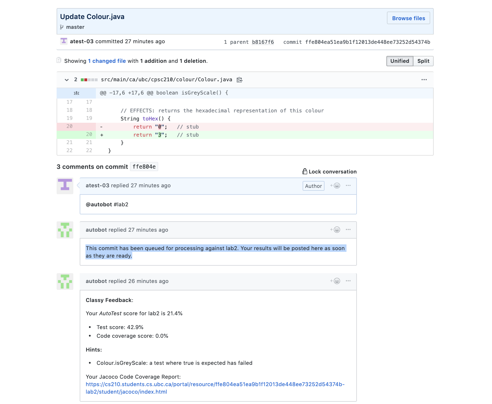
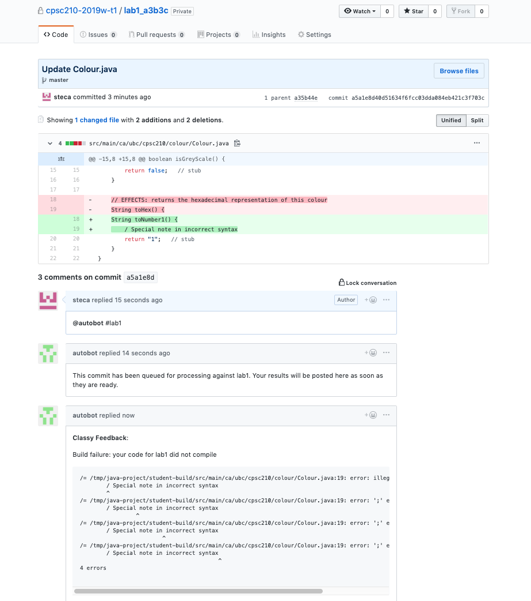
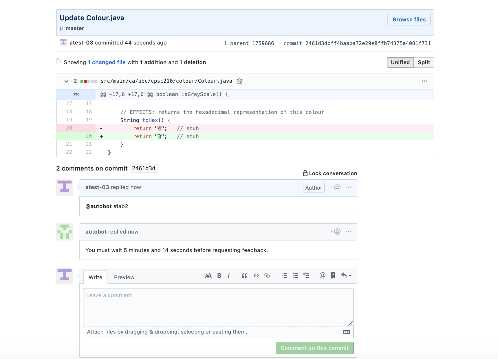
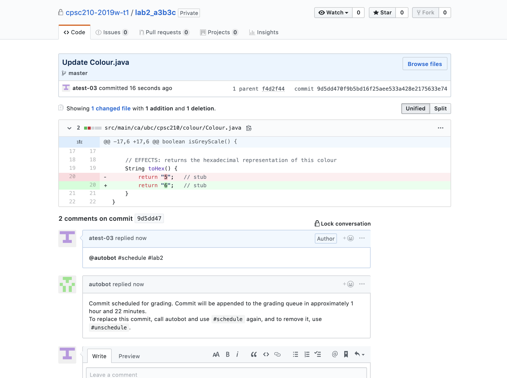

# Features

## Portal

Portal is a front-end application that manages deliverable configuration, repository creation, and teams for AutoTest.

- Dashboard to view grading results and logs
- Configure Docker containers to automatically mark course assignments on a per assignment basis.
- Design and integrate your own Docker container to mark student assignments.
  - 1-to-1 or 1-to-many Docker container to assignment grading capabilities.
- Manage when assignments are automatically graded with open and close dates.
- Create Github Teams for assignments and assign the team to share a repo
- Assign students to their respective repos to work on their assignment.
- View and export grade results to CSV format.
- Import latest Classlist information by clicking on a button.

Portal uses Onsen UI, a lightweight JavaScript framework, on the front-end and Restify, a Node JS RESTful API, on the back-end. Custom logic can be added to Portal by following the [Back-end Customization]((/docs/instructor/gettingstarted.md#front-end-setup)) and [Front-end Customization](/docs/instructor/gettingstarted.md#front-end-setup) steps in the Instructor area of the [Table of Contents](/README.md#table-of-contents).

## AutoTest

AutoTest is a service that listens for `push` and `comment` events in repositories managed by AutoTest. AutoTest has the ability to start a container to grade or analyze code based on logic that an instructor has programmed into a Docker container. Currently, AutoTest is tightly integrated with GitHub, although it has been designed so it could also receive grading requests through other means (e.g., through some form of REST-based invoker). The document below describes the current GitHub-oriented version of AutoTest.

AutoTest can compute feedback either when a GitHub push event (e.g., a `git push`) is received or when a user makes a comment on a commit (e.g., they use the GitHub web interface to make a comment that references the AutoTest bot). The name of the bot is configurable, but we will use `@autobot` for the remainder of this document. These messages should take the form `@autobot <delivId> [flags]`. For example `@autobot #d1` or `@autobot #d4`. Flags do not need to be provided unless needed; the complete list of flags includes:

* `#schedule` Schedules a commit for grading in the future when the student's quota is available again. For instance, by default calling `@autobot #d2` when the student still has 6 hours remaining before they can request again does not actually queue the submission for grading. By calling `@autobot #d2 #schedule` the submission will be automatically graded when the student's quota allows. Note: each student has only one `#schedule` slot; only the most recent `#schedule` event will be serviced; once this is complete the slot is available again.

* `#unschedule` Unschedules a commit; this is not strictly necessary as servicing a scheduled grading submission does this automatically (as does calling `#schedule` on another commit), but this is a convenience method that ensures the student does not have a scheduled event requested.

* `#check` Checks to ensure a commit has been queued for grading. This is often used by students who want to confirm that their submission is in fact on the grading queue.

* `#force` Admin-user only. Forces the submission to be re-graded (e.g., purges the cached result if it exists and grades it again).

* `#slient` Admin-user only. This is used to invoke the bot, but suppresses feedback. `#silent` is usually used in conjunction with `#force`.

## Github and AutoTest Examples

In the following scenarios, an instructor has pre-configured AutoTest to mark all `lab2` deliverables using a custom Docker container that he has built. The expected behaviour of AutoTest is demonstrated based on the student actions.

### Student requests feedback for an assignment

A student pushes code to a repository and requests feedback for the commit displayed in the view. The students requests the grade by commenting, `@autobot #deliverableName`. AutoBot begins to grade the assignment and gives the student a notification to wait for the grade result. Once the assignment is graded, the computed message programmed by the instructor in the Docker container is output in the commit SHA comment area.

### Student requests feedback for an assignment that fails to compile

A student pushes code to the repository that does not compile and requests a grade for it. The container has been programmed to output a computed message that includes a compilation failure. The instructor does not explicitly say that the grade feedback is 0% for this commit, but a 0% grade has been recorded in the **Portal** Admin Dashboard, included in a `report.json` file output to AutoTest from the container.

### Student requests feedback for an assignment before configured allotted time

A student pushes code to a repository and requests feedback for the commit displayed in the view. The request for feedback is too soon, as a longer time period was configured by the instructor in the *Deliverable Admin Configuration Panel*. `AutoBot` tells the student to wait for the remaining time period.

### Student requests feedback for an assignment before configured allotted time and schedules next feedback event

A student pushes code to a repository but cannot request grade feedback because the student is within the configured delay period. The student schedules feedback by using the `#schedule` flag with the specified deliverable in a grade request to `AutoBot`.

