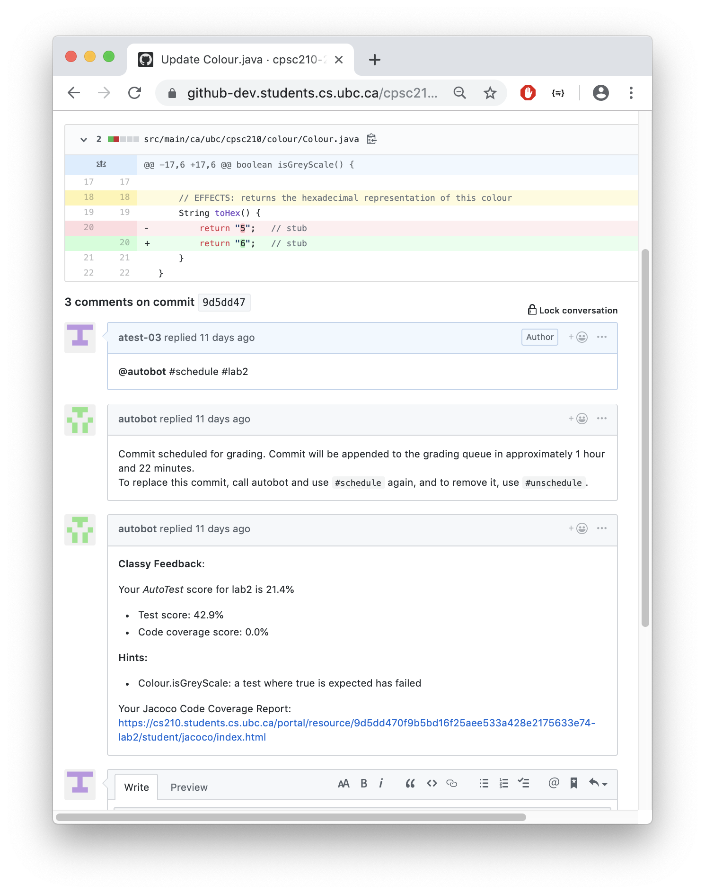

# Overview

<!-- TOC depthfrom:2 -->
- [Overview](#overview)
  - [Portal](#portal)
  - [AutoTest](#autotest)
  - [Github and AutoTest Examples](#github-and-autotest-examples)
    - [Student User Examples](#student-user-examples)
      - [Feedback for an Assignment](#feedback-for-an-assignment)
      - [Feedback for an Assignment that Fails to Compile](#feedback-for-an-assignment-that-fails-to-compile)
      - [Feedback for an Assignment Before Allowed Time](#feedback-for-an-assignment-before-allowed-time)
      - [Feedback for an Assignment Using #schedule Feature](#feedback-for-an-assignment-using-schedule-feature)
<!-- /TOC -->

Classy is an application that helps instructors distribute and automatically grade assignments. Classy integrates with Github to create an environment where students can gain real-world and practical hands-on experience with *Git* version control.

Classy consists of a front-end application named *Portal* and a back-end application named *AutoTest*. *Portal* helps instructors manage course administration by enabling instructors to setup assignments, setup autograding, and manage grades. *AutoTest* integrates with Github to create an interactive experience for students by giving automated feedback and notifying a student if a build fails on `commit` and `push` actions. *AutoTest* supports the full customization of these features to fit the business requirements of the course.

## Portal

- Dashboard to view grading results and logs
- Automatically mark course assignments using Docker containers.
  - 1-to-1 or 1-to-many Docker container to assignment grading capabilities.
- Manage when assignments are automatically graded with open and close dates.
- Assign students private repos to work on assignments.
- Assign teams a common private repo to collaborate on.
- View/export grades (grade export supports CSV format).
- Import/update Classlist information directly through API.
- Implement custom front-end views and features using JavaScript and RESTful APIs.

## AutoTest

- Students receive grade feedback for grade requests on `commit` actioms and automatic build failure notifications on `push` actions.
- Student grade feedback quotas based on customizable time.
- Instructors build Docker containers to compute automated feedback and grades for code commits.
- TAs have access to container logs and grades to quickly give human feedback to students.
- Grading and feedback containers are configurable for 1-to-many assignments and 1-to-1 assignments.
- Supports regression testing assignments.

## Github and AutoTest Examples

In the following scenarios, an instructor has pre-configured AutoTest to mark all `lab2` deliverables using a custom Docker container that he has built. The expected behaviour of AutoTest is demonstrated based on the student actions.

### Student User Examples

#### Feedback for an Assignment

A student pushes code to a repository and requests feedback for the commit displayed in the view. The students requests the grade by commenting, `@autobot #deliverableName`. AutoBot begins to grade the assignment and gives the student a notification to wait for the grade result. Once the assignment is graded, the computed message programmed by the instructor in the Docker container is output in the commit SHA comment area.

#### Feedback for an Assignment that Fails to Compile

A student pushes code to the repository that does not compile and requests a grade for it. The container has been programmed to output a computed message that includes a compilation failure. The instructor does not explicitly say that the grade feedback is 0% for this commit, but a 0% grade has been recorded in the **Portal** Admin Dashboard, included in a `report.json` file output to AutoTest from the container.

#### Feedback for an Assignment Before Allowed Time

- User role: `student`

A student pushes code to a repository and requests feedback for the commit displayed in the view. The request for feedback is too soon, as a longer time period was configured by the instructor in the *Deliverable Admin Configuration Panel*. `AutoBot` tells the student to wait for the remaining time period.

#### Feedback for an Assignment Using #schedule Feature

A student pushes code to a repository but cannot request grade feedback because the student is within the configured delay period. The student schedules feedback by using the `#schedule` flag with the specified deliverable in a grade request to `AutoBot`.

