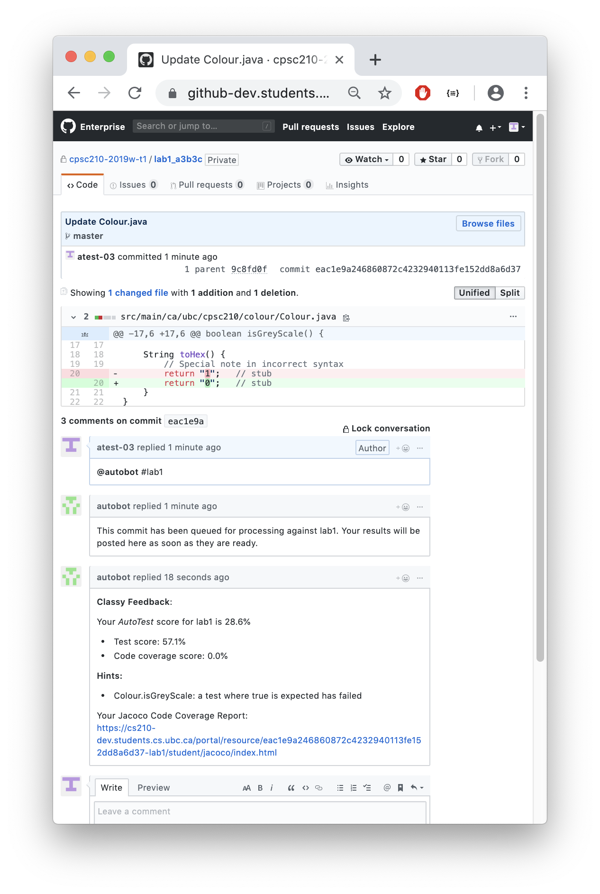
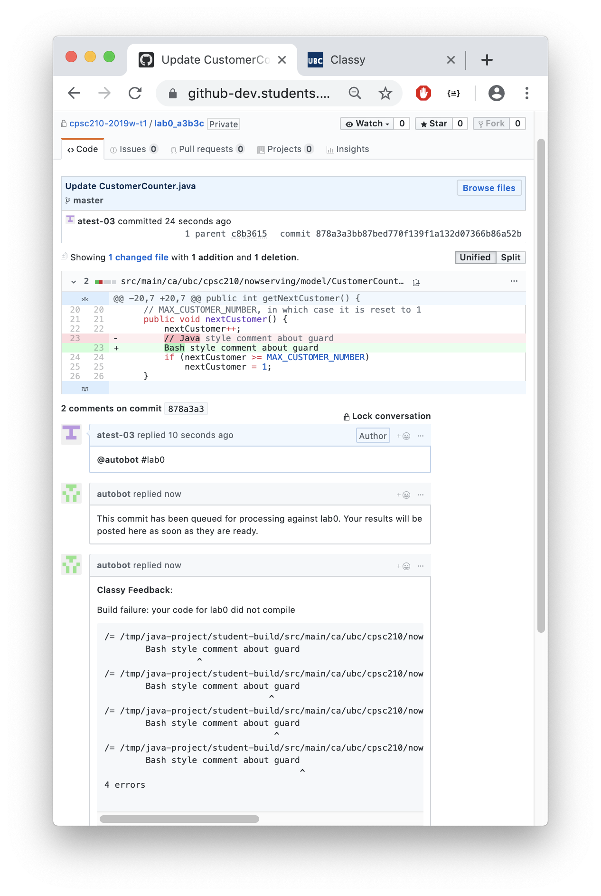

# Overview

<!-- TOC depthfrom:2 -->
- [Overview](#overview)
  - [Portal](#portal)
  - [AutoTest](#autotest)
  - [Github and AutoTest Examples](#github-and-autotest-examples)
    - [Student Role Examples](#student-role-examples)
      - [Feedback for an Assignment](#feedback-for-an-assignment)
      - [Feedback for an Assignment that Fails to Compile](#feedback-for-an-assignment-that-fails-to-compile)
      - [Feedback for an Assignment Before Allowed Time](#feedback-for-an-assignment-before-allowed-time)
      - [Feedback for an Assignment Using #schedule Feature](#feedback-for-an-assignment-using-schedule-feature)
    - [Admin Role Examples](#admin-role-examples)
      - [Request Feedback When Student Cannot](#request-feedback-when-student-cannot)
      - [Force a Re-Grade](#force-a-re-grade)
      - [Force Silent Re-Grade](#force-silent-re-grade)
<!-- /TOC -->

Classy helps automate the distribution and grading of assignments. Classy integrates with Github to create an environment where students can gain real-world and practical hands-on experience with *Git* version control while getting real-time feedback on the quality of their code.

Classy's front-end consists of a front-end JavaScript framework and supporting RESTful API called *Portal*. *Portal* helps instructors manage course administration by automating tasks, such as setting up assignments, grading, and grade management for instructors. Classy has another RESTful API to manage complex back-end Github and grading logic called **AutoTest**. *AutoTest* integrates with Github to create an interactive grading experience.

AutoTest's features include automated feedback to grade requests from students that they request on  `commit` comments on Github. Grade feedback is completely customizable and developed by an instructor to meet the requirements of their course. Feedback can be produced where a student code builds, fails to build, reaches a grade threshold, etc. and allows for additional reports to be included.

## Portal

- Dashboard to view grading results and logs
- Automatically mark course assignments using Docker containers
  - 1-to-1 or 1-to-many Docker container to assignment grading capabilities
- Manage when assignments are automatically graded with *open* and *close* dates
- Distribute private repositories to students
- Distribute private repositories to teams of students
- View/export grades in CSV format
- Import/update Classlist information directly through API
- Implement custom features using JavaScript MVC and RESTful APIs

## AutoTest

- Students receive grade feedback and build failure notifications when new *commits* are *pushed* to Github.
- Student grade feedback customizable time delays
- Custom build Docker containers to grade code how you prefer
- Access to container logs and grades by TAs get help support students
- Docker containers can mark 1-to-many assignments and 1-to-1 assignments
- Supports regression testing

## Github and AutoTest Examples

In the following scenarios, an instructor has configured the `lab2` deliverable to be marked by a custom built AutoGrade container. AutoTest runs the AutoGrade container each time a student pushes code to Github and marks the latest commit. The expected behaviour of AutoTest is demonstrated based on the student actions.

### Student Role Examples

#### Feedback for an Assignment

A student pushes code to a repository and requests feedback for the commit displayed in the view. The students requests the grade by commenting, `@autobot #deliverableName`. AutoBot begins to grade the assignment and gives the student a notification to wait for the grade result. Once the assignment is graded, the computed message programmed by the instructor in the Docker container is output in the commit SHA comment area.

#### Feedback for an Assignment that Fails to Compile

A student pushes code to the repository that does not compile and requests a grade for it. The container has been programmed to output a computed message that includes a compilation failure. The instructor does not explicitly say that the grade feedback is 0% for this commit, but a 0% grade has been recorded in the **Portal** Admin Dashboard, included in a `report.json` file output to AutoTest from the container.

#### Feedback for an Assignment Before Allowed Time

A student pushes code to a repository and requests feedback for the commit displayed in the view. The request for feedback is too soon, as a longer time period was configured by the instructor in the *Deliverable Admin Configuration Panel*. `AutoBot` tells the student to wait for the remaining time period.

#### Feedback for an Assignment Using #schedule Feature

A student pushes code to a repository but cannot request grade feedback because the student is within the configured delay period. The student schedules feedback by using the `#schedule` flag with the specified deliverable in a grade request to `AutoBot`.

### Admin Role Examples

#### Request Feedback When Student Cannot

A student pushes code to a repository but cannot request grade feedback because of the grade feedback delay. In any such case, an admin or staff may override the delay and request feedback.

#### Force a Re-Grade

A student may request that pushed code is re-graded if an error is suspected with the grade result. An admin or staff may force the re-grade of a commit. If a prior grade result exists, it will be purged and replaced by the new result.

#### Force Silent Re-Grade

If there is a known error with a grade result, but the grade results should still be kept secret, an admin or staff may request a silent re-grade of a commit. If a prior grade result exists, it will be purged and replaced by the new result.

