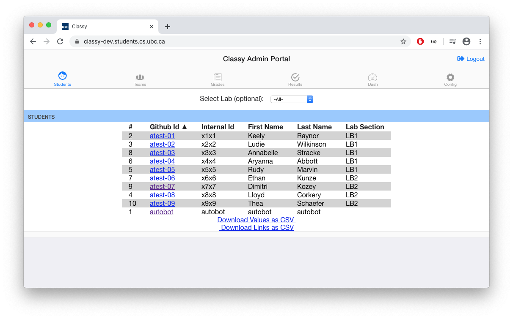
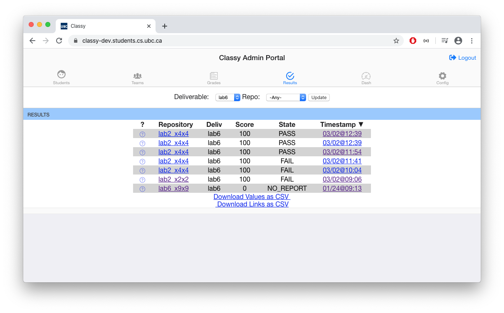
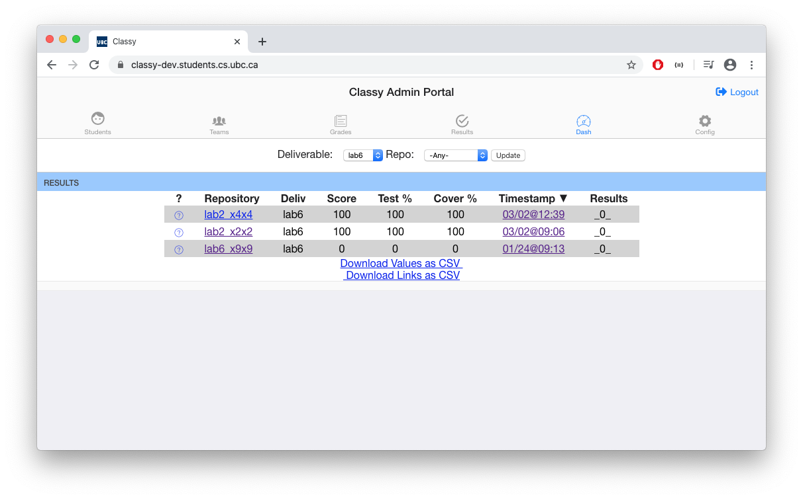
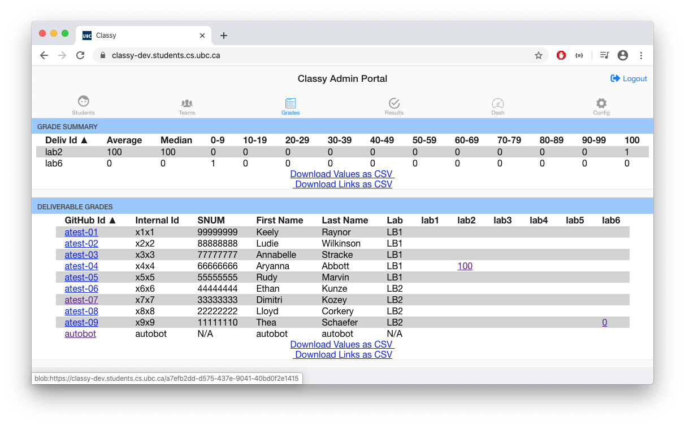

# Getting Started

## Overview

Classy requires some implementation work and learning before it can be used in a course. Here are some first steps to get you started:

- [ ] Shadow a course that uses Classy before you begin to use it
- [ ] Request [Classy for your Course](#requesting-classy-for-your-course) at least three weeks in advance of course start date.
- [ ] Read about [Default Classy Plugin](#default-classy-plugin) and customization option.
- [ ] Give tech staff a Github token to access [AutoGrade Dockerfile Repository](/docs/instructor/autograde.md#autograde-dockerfile-repository).

Nice-to-have's:

- [ ] Retain a TA to build-out Docker AutoGrade container.
- [ ] Add container logging that allows for quick debugging of container logic.

Github is integrated with Classy and Github requires that you use Git version control. Syllabus and course instructions will need to be updated to work with *Git* version control.

## Requesting Classy for Your Course

You must formally request Classy by notifying *CPSC Technical Staff*. Classy takes approximately two weeks to setup because of software, hardware, and CPSC technical staff resources that are necessary to run the software while upholding privacy and data laws.

Please start a discussion with CPSC Technical Staff as soon as you develop an interest in using Classy.

## Default Classy Plugin

Classy comes with default MVC, course controller, and route logic. The default plugin is generic Classy logic and should meet the requirements of most courses. The default plugin can be copied to a new folder and completely customized by your course. For more information, visit the [Customization](/docs/developer/customization.md) section of the table of contents.

### Admin Students Panel

*Displays basic student information.*

### Admin Results Panel

*Displays basic the result recordd with the highest scores per single or team repository.*

### Admin Dashboard Panel

*Displays the spread of grade, test coverage, and test score percentages per deliverable.*

### Admin Grades Panel

*Displays student grades per deliverable with a summary of grade averages.*

