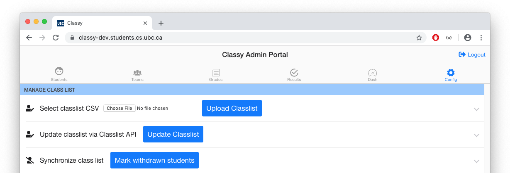
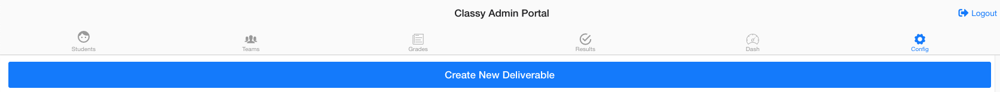
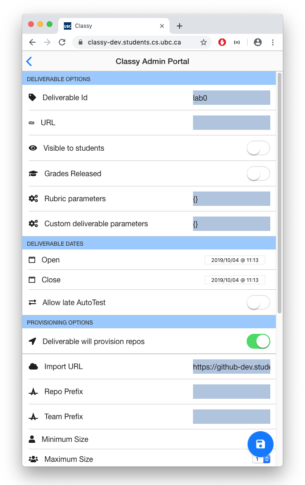
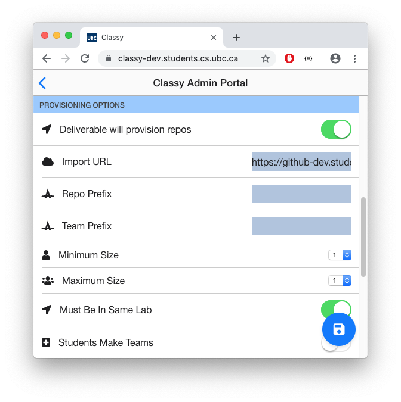

# Portal Manual

<!-- TOC depthfrom:2 -->
- [Portal Manual](#portal-manual)
  - [Overview](#overview)
  - [Classlist Enrollment](#classlist-enrollment)
  - [Deliverable Configuration](#deliverable-configuration)
  - [Distributing Assignments and Repository Creation](#distributing-assignments-and-repository-creation)
<!-- /TOC -->

## Overview

AutoTest configurations allow for the unique customization of course content. The configuration steps below give you basic introduction to steps for a typical course delivery. Click on the UI header of a configuration setting to see more detailed instructions.

## Classlist Enrollment

Classy is integrated with Classlist to access student enrollment information. An instructor must update the classlist enrollment before Classy receives any student enrollment information.

The **Admin Settings** view contains an **Update Classlist** button that automatically retrieves the current student information from Classlist. Add, update, and delete information will be viewable each time you click on **Update Classlist**.

If more customizable classlist updates are necessary, a CSV may be uploaded with a custom classlist by the instructor. To upload a custom CSV, you will need to add the `ACCT`, `SNUM`, `CWL`, `LAST`, `FIRST`, and `LAB` headers to the CSV to produce a format accepted by Classy.

## Deliverable Configuration

A deliverable has many possible configurations that result in unique AutoTest behvaiour, but most AutoTest behaviour is impossible without a deliverable. Creating a deliverable is *necessary* before one can:

- provision repositories to students
- recieve AutoTest feedback on `commit` and `push` events
- store grade information in Classy and display it on the Admin Grade Dashboard

These prior three actions create the core scope of desirable AutoTest functionality. Hence, if you are learning how to use AutoTest and you are not sure where to start, always start by creating a deliverable. The **Admin Configuration Panel** will display the option of creating a deliverable:

The **Admin Configuration Panel** will display a list of all deliverables. Clicking on the deliverable will open up a list of configuration settings for the deliverable:

It is *mandatory* to include a `Deliverable Id` name. The `Deliverable Id` cannot be changed once it is created. All other configuration settings on the **Deliverable Configuration Panel** are *optional*.

## Distributing Assignments and Repository Creation

As AutoTest deals with sensitive student information, all repositories that are provisioned will be private. Only staff and admin roles have access to private repositories.

Repository Provisioning Pre-Requisites:

- [Classlist Enrollment](#classlist-enrollment)
- [Deliverable Creation/Configuration](#deliverable-configuration)

`Provisioning Options` *should* be considered before provisioning repositories. It is likely that an instructor will want to distribute starter code as boilerplate material for a student, as it will give the assignment a structure that helps integrate it with autograding functionality:

Once the pre-requisites have been met and your provisioning options have been configured, an option to **provision** and **release** repositories can be found under **Admin Configuration Panel** by clicking on **Manage Repositories**.

*Provisioning* repositories will create the Github repositories and place starter code in the assignment. Due to Github limitations, it takes approximately 5 seconds to distribute a repository. If your class has many students, you must leave enough time to provision the repositories (ie. ~2 hours for a large class).

*Releasing* repositories gives a student or team access to read and write to their Github repositories. This action is much quicker than repository provisioning and will likely not take longerj than 2 minutes for an entire class.

