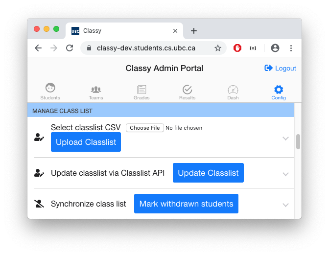
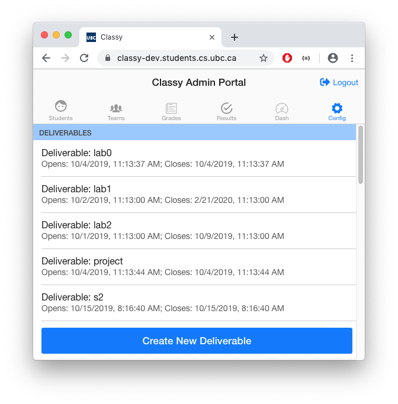

# Portal Manual

<!-- TOC depthfrom:2 -->
- [Portal Manual](#portal-manual)
  - [Overview](#overview)
  - [Classlist Enrollment](#classlist-enrollment)
  - [Deliverable Configuration](#deliverable-configuration)
  - [Distributing Assignments and Repository Creation](#distributing-assignments-and-repository-creation)
<!-- /TOC -->

## Overview

AutoTest configurations allow for the unique delivery of course content based on course requirements. The configuration steps below give you basic introduction to steps for a typical course delivery. For further insight into a step, a user can click on the UI header to see more detailed instructions.

## Classlist Enrollment

Classy does not automatically know what students are enrolled in your course. An API endpoint with student information has been integrated with Classy that allows it to access the *current* enrollment information for a course. An instructor must update the classlist enrollment before the application can interact with any student information.

The default Admin view contains a **Update Classlist** action that adds students, updates student information, removes deregistered students. This button action, therefore, should be treated as an upsert. A list of the modifications for each add, update, and remove event can be viewed after the update and saved if necessary.

If more customizable classlist updates are necessary, a CSV may be uploaded with a custom classlist by the instructor. To upload a custom CSV, you will need to add the `ACCT`, `SNUM`, `CWL`, `LAST`, `FIRST`, and `LAB` headers to the CSV to produce a format accepted by Classy.

## Deliverable Configuration

A deliverable has many possible configurations that result in unique AutoTest behvaiour, but most AutoTest behaviour is impossible without a deliverable. Creating a deliverable is *necessary* for the following actions:

- provisioning repositories to students with or without starter code
- AutoTest feedback on `commit` and `push` events
- storing grade information in Classy and displaying it on the Admin Grade Dashboard

These three actions, however, create the core scope of desirable AutoTest functionality. Hence, if you are learning how to use AutoTest and you are not sure where to start, always start by creating a deliverable. The **Admin Configuration Panel** will display the option of creating a deliverable:

</>

The **Admin Configuration Panel** will display a list of all deliverables. Clicking on the deliverable will open up a list of configuration settings for the deliverable:

It is *mandatory* to include a `Deliverable Id` name. The `Deliverable Id` cannot be changed once it is created. All other configuration settings on the **Deliverable Configuration Panel** are *optional*.

## Distributing Assignments and Repository Creation

Repositories are Git workspace areas where version control history is stored privately or publicly. As AutoTest deals with sensitive student information, all repositories that are provisioned will be private. Only staff and admin roles have access to private repositories as standard AutoTest behaviour because admin and staff teams need access to student code. Staff and admins are given admin access to any repository that is provisioned by AutoTest by adding the staff and admins to respective `admin` and `staff` teams that are granted admin repository permissions.

Repository creation *necessary* pre-requisites:

- Classlist enrollment
- Deliverable has been created

`Provisioning Options` *should* be considered before provisioning repositories. It is likely that an instructor will want to distribute starter code as boilerplate material for a student, as it will give the assignment a structure that helps integrate it with autograding functionality:

Once the pre-requisites have been met and your provisioning options have been configured, an option to **provision** and **release** repositories can be found under **Admin Configuration Panel** by clicking on **Manage Repositories**.

*Provisioning* repositories will create the Github repositories and place starter code in the assignment. If you class has many students, you must leave enough time to provision the repositories (ie. ~2 hours). It takes approximately 5 seconds to distribute 1 repository due to Github limitations.

*Releasing* repositories gives a student or team access to read and write to their Github repositories. This action is much quicker than repository provisioning and will likely not take longerj than 2 minutes.
