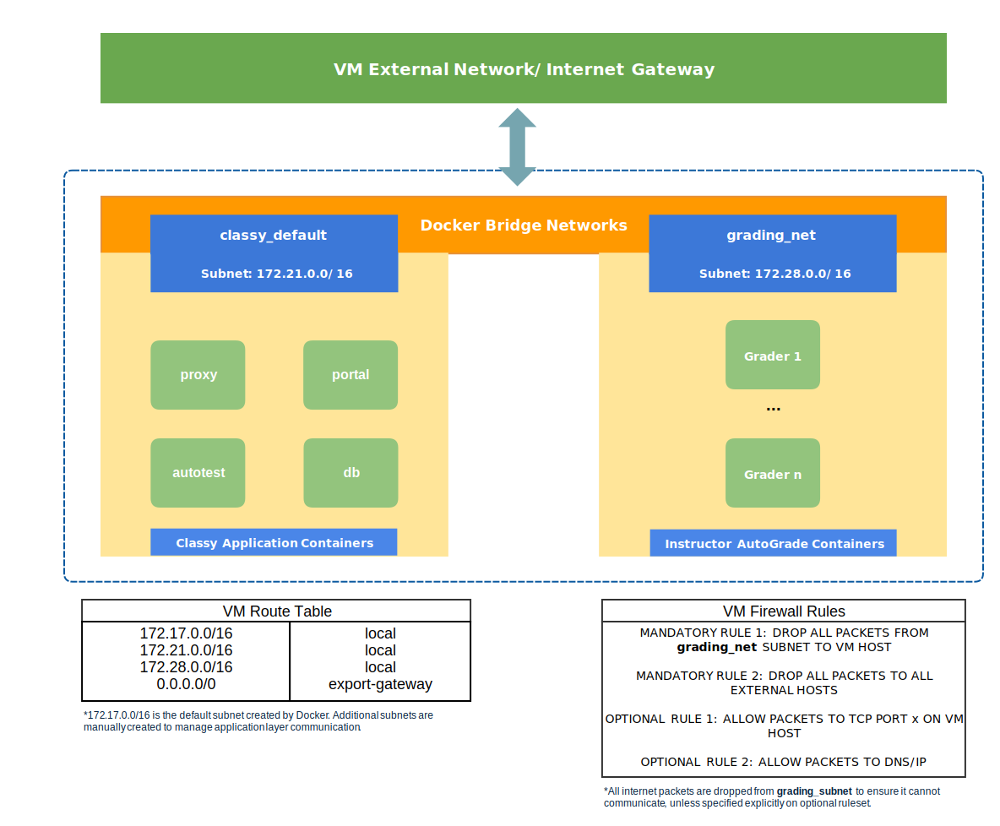

# Architecture

<!-- TOC depthfrom:2 -->

- [Architecture](#architecture)
  - [Overview](#overview)
  - [Network Layer](#network-layer)
  - [Application Layer](#application-layer)
  - [Data Layer](#data-layer)

<!-- /TOC -->

## Overview

Classy consists of three supporting applications: AutoTest, Portal Front-End, and Portal Back-End. Classy uses MongoDB as its data store. The applications are containerized, which means that they run in Docker containers. Each Classy instance is hosted on a single VM where the containerized applications share a single enviromental configuration file.

Running Classy requires operations support to manage its integrated systems, SSL certificates, ongoing development, hardware requirements, and security updates. Classy has a moderate amount of complexity that requires instructions are accurately followed when bootstrapping integrated systems and customizing its configuration.

## Network Layer

The network layer requires access to the internet to install, build, and run Classy. Docker Compose is a Docker orchestration tool that simplifies the installation and operation of Classy.

If Docker is properly installed and the environment that is hosting Classy has access to the internet, minimal effort is needed to setup the network layer.

## Application Layer

In staging and production environments, the appication layer is broken into supporting applications that are Dockerized. The Portal and AutoTest applications are Node JS based applications that are hosted with Nginx routing and a NoSQL MongoDB database.

## Data Layer

The data layer consists of the MongoDB database, which is containerized and started with the applications layer.

MongoDB is mounted to share a volume on the host VM to ensure that data persists after the container is stopped and started.
