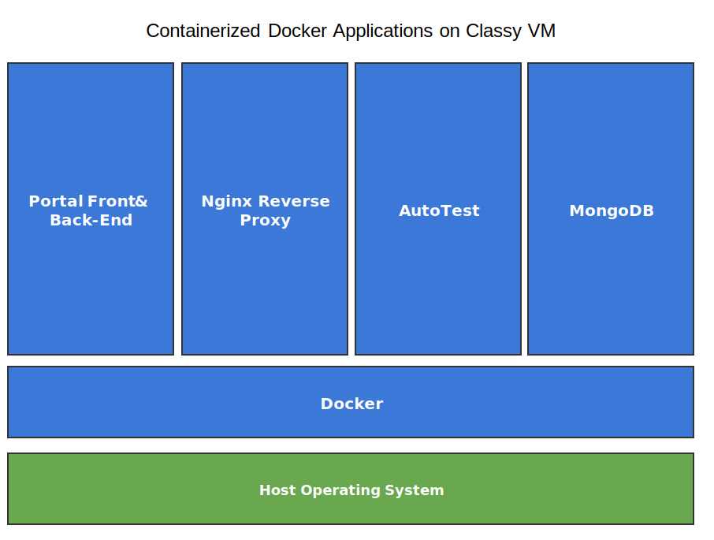

# Architecture

## Overview

Classy consists of multiple supporting applications: AutoTest, Portal Front-End, and Portal Back-End. Classy uses MongoDB for its data layer. The applications are containerized, which means that they run in Docker containers in a virtual environment where they can communicate. The virtual that currently hosts Classy is a VM server.

## Network Layer

The network layer requires access to the internet to install, build, and run Classy. Docker Compose is a Docker orchestration tool that simplifies the  installation and running of Classy.

If Docker is properly installed and the environment that is hosting Classy has access to the internet, minimal effort is needed to setup the network layer.

## Application Layer

The appication layer is containerized for staging and production Classy instances. The Portal and AutoTest applications are Node JS based applications that are hosted with Nginx routing and a NoSQL MongoDB database.

