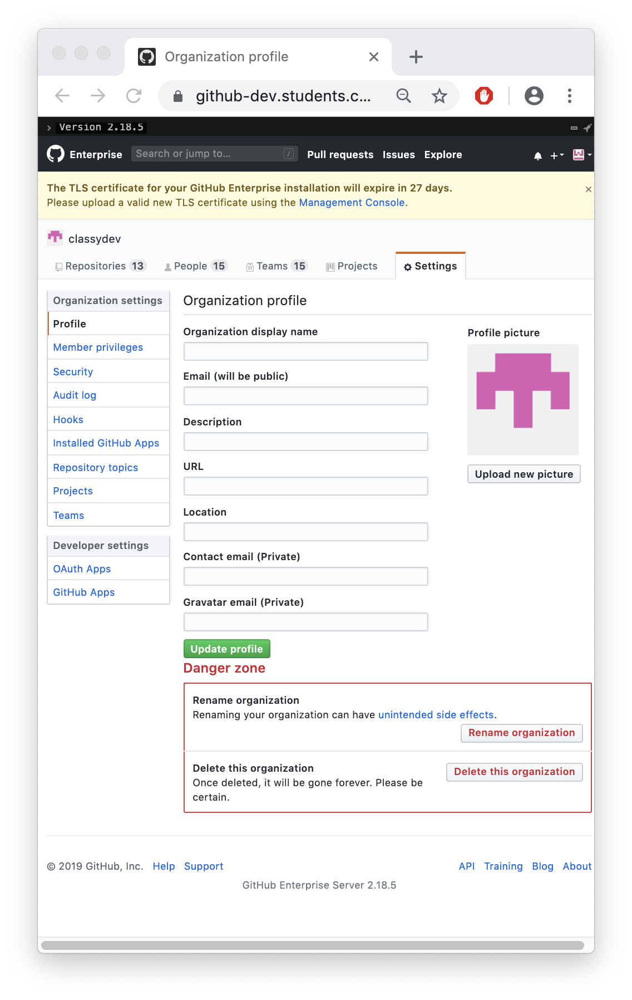
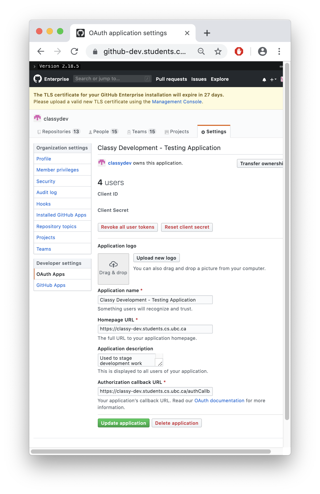
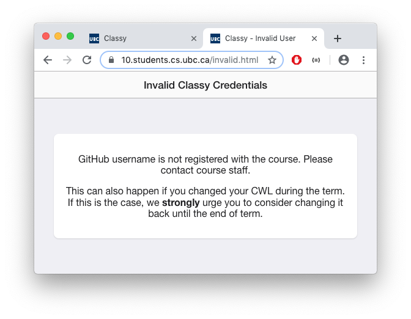
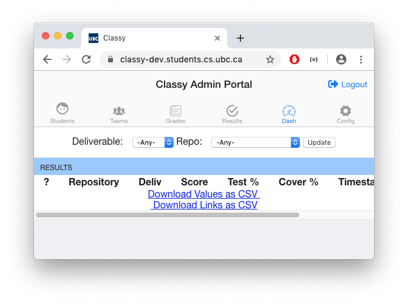

# GitHub Setup

<!-- TOC depthfrom:2 -->
- [GitHub Setup](#github-setup)
  - [Integrate GitHub](#integrate-github)
    - [Add User as GitHub Organization Owner](#add-user-as-github-organization-owner)
    - [Add Students and Staff to GitHub Organization](#add-students-and-staff-to-github-organization)
    - [Add Admins to GitHub Organization](#add-admins-to-github-organization)
    - [Setup GitHub OAuth](#setup-github-oauth)
    - [Setup AutoBot Integration](#setup-autobot-integration)
    - [Setup AutoGrade Integration](#setup-autograde-integration)
  - [Debug GitHub](#debug-github)
    - [Invalid Classy Credentials](#invalid-classy-credentials)
    - [GitHub Integration - Expected Behaviour](#github-integration---expected-behaviour)
    - [GitHub Issues](#github-issues)
      - [Repo Retirement](#repo-retirement)
<!-- /TOC -->

*Classy is integrated with GitHub.com or GitHub Enterprise to provide a gamified and interactive learning experience for students. When a student pushes code to a GitHub repository, Classy gives feedback and a grade to the student. Classy, therefore, requires the appropriate permissions to access and interact with a student repository.*

This setup guide describes the appropriate GitHub organization setup steps from the appropriate user roles.

## Integrate GitHub

### Add User as GitHub Organization Owner

Professors and Technical Staff may be granted the organization `owner` role, which allows unlimited access to all entities and actions in the organization. The organization `owner` role is necessary to setup OAuth integration.

### Add Students and Staff to GitHub Organization

At the moment, **students** and **staff** are automatically added to the appropriate GitHub organization teams for a specific course. Contact Michael Sanderson each time a Classy configuration is setup for a class to verify that students for that course will automatically be added the appropriate GitHub organization. Michael Sanderson has implemented logic to continuously update the organization teams with the current class list registry. If a student drops the course, the student will automatically be removed by his logic.

### Add Admins to GitHub Organization

Admins must be manually added to an organization team by an owner of the organization. Admin examples are course instructors, assistants (not TAs unless instructed by the course instructor), and technical staff from our department. There is no automated logic to add admin users in a GitHub organization anywhere. GitHub organization owners and GitHub admins have permission to add a user to the admin team.

### Setup GitHub OAuth

A student can login to Classy by entering their CWL username password and credentials because Classy is integrated with GitHub Enterprise and GitHub is integrated with LDAP (aka. CWL usernames).

OAuth configuration is set in the **/opt/classy/.env** file by configuration two OAuth credential values.

How To Produce OAuth Credentials:

  1. Login as an owner of the organization.
  

  2. Click on the organization settings.
  

  3. Click on OAuth Apps under the Developer Settings side-panel.
  

*The two blue fields are intentionally removed. The Client ID and Client Secret must be entered into the **/opt/classy/.env** environment properties.*

**NOTE**: CWL and GitHub.com integrations are NOT compatible. If Classy is integrated with GitHub.com instead of GitHub Enterprise, real GitHub users are required.

### Setup AutoBot Integration

- Login as the bot name decided for the course (AutoBot is the standard user unless requested by instructor)
- Click on the user settings icon and click on Developer Settings.
- Click on Personal Tokens side-panel option.
- Under the Personal Tokens view, you will have the option to generate a new token or configure re-generate a pre-configured token.

WARNING: IF you decide to regenerate a pre-configured token, but the token is being used by another Classy server, you will break the course until a token is updated in the .env file for that course instance. If you lose track of the tokens, the safest way forward is to generate a new token, until the problem can be fixed at the end of the next semester.

TO DO: Screenshot of the GitHub access permissions for the token.

### Setup AutoGrade Integration

**WARNING**: Classy can **ONLY** have one **GH_DOCKER_TOKEN** configured in the **/opt/classy/.env** file. If a course has multiple instructors who each would like to build an AutoGrade docker container to mark their assignments, they **MUST** share the token. Hence, the token should be generated from an user level that has permission to all of their AutoGrade container GitHub repositories. See [Instructor AutoGrade Creation Manual](/docs/instructor/autograde.md#overview) for more information on how to clone AutoGrade container repositories.

- Login as user with permissions to view the AutoGrade repository when it is private.
- Repeat the steps from [Classy Bot Token](#classy-bot-token-steps) generation above.

TO DO: Screenshot of the GitHub access permissions for the token.

<TO DO: Details on how the enviornmental config file should be updated should be included when you have your repository, users, and API keys created>

## Debug GitHub

### Invalid Classy Credentials

*If you, or all students, are experiencing this error, then Classy cannot find a user in the admin, student, or staff groups on GitHub.*

How to Debug:

  1. Login to GitHub through the UI.
  2. Visibly inspect the organization teams to confirm that the CWL user(s) who is experiencing this error has been added to an **admin**, **staff**, or **students** team.
    a. If an admin user is missing, add them manually.
    b. If a staff or student user is missing, contact Michael Sanderson to determine why they are missing. He should fix it, as users will automatically be removed from the staff and admin teams if they are not in the class list registry. 

  After adding the user(s) to the appropriate team, reload the view to see if the issue is fixed, **OR** continue to the next debug step.
  3. If the CWL user has been added to a team, but this error persists, it is likely that Classy does not have permission to read the team to see what users exist underneath it.

Reload the view after each of these steps to see if the issue is fixed:

  a) Ensure that the **GH_BOT_TOKEN** in the **/opt/classy/.env** file is configured with a token in the format `token longStringSHAHere`. `token ` must precede the `longStringSHAHere` value.
  b) If a token is configured, ensure that the token is from a GitHub user that has access to the teams and organization. An owner privilege is required for the bot.
  c) If you cannot trace the token, configure a new token under the GitHub user settings **GitHub Developer** page.

### GitHub Integration - Expected Behaviour

A user who logs into Classy should be met with a Student, Staff, or Admin view with icon tabs across the main page after logging in.

Login screen → GitHub OAuth Login Page (CWL background integration) → Screenshots of Student/Staff/Admin views.

  1. Go to Classy website (ie. https://classy-dev.students.ubc.ca). Click on 'Portal Login' to start authentication flow:
  

  2. See the students, staff, or admin page depending on user permissions:
  

  3. The admin should be able to clone repositories with starter code in the repository.
  4. The admin should be able to clone the Git repository that is used to build his AutoGrade container.

### GitHub Issues

#### Repo Retirement

Occasionally, a GitHub organization will encounter an API bug that cannot be resolved without technical support (which may take time). If you do re-create an organization, repository names that are deleted with an organization will be **retired**. Retiring a repository precludes the creation of a new repository with the same name under the organization when it is re-created.

If this issue is encountered, you may either have to contact GitHub to coordinate un-retiring repositories or create a new organization name.
